# DATABASE_DESIGN.md

## Conventions

- Table names: `snake_case`, plural.
- Primary keys: `id` (unsigned bigint, auto-increment).
- Foreign keys: `{singular_table}_id`, indexed, `constrained()->restrictOnDelete()` unless a
  cascade is explicitly correct (e.g., a pivot row belonging entirely to its parent).
- Timestamps: `created_at`, `updated_at` on every table. `deleted_at` (soft delete) on any
  table representing an institutional record that may already be referenced elsewhere
  (students, faculty, departments, programs, curricula, courses, grades, documents,
  equipment, etc.) per business rule "archived records must not appear in active lists by
  default" and "deleting referenced academic records should be prevented."
- Status/category fields use PHP backed enums (`App\Enums\...`) validated at the application
  layer and stored as `string` columns (not MySQL `ENUM`) so new statuses can be added via
  code + migration without an `ALTER TABLE ... MODIFY` schema change.
- Every table frequently filtered or joined on has an index on the relevant foreign key
  and, where applicable, a composite index matching real query patterns (e.g.
  `student_id + academic_year_id + semester_id`).
- Money/points/units: `decimal` columns, never `float`.

## Phase 1 ERD

This is the actual schema being built in Phase 1. Later phases append their own ERD section
below rather than speculatively drawing ~80 tables before they exist.

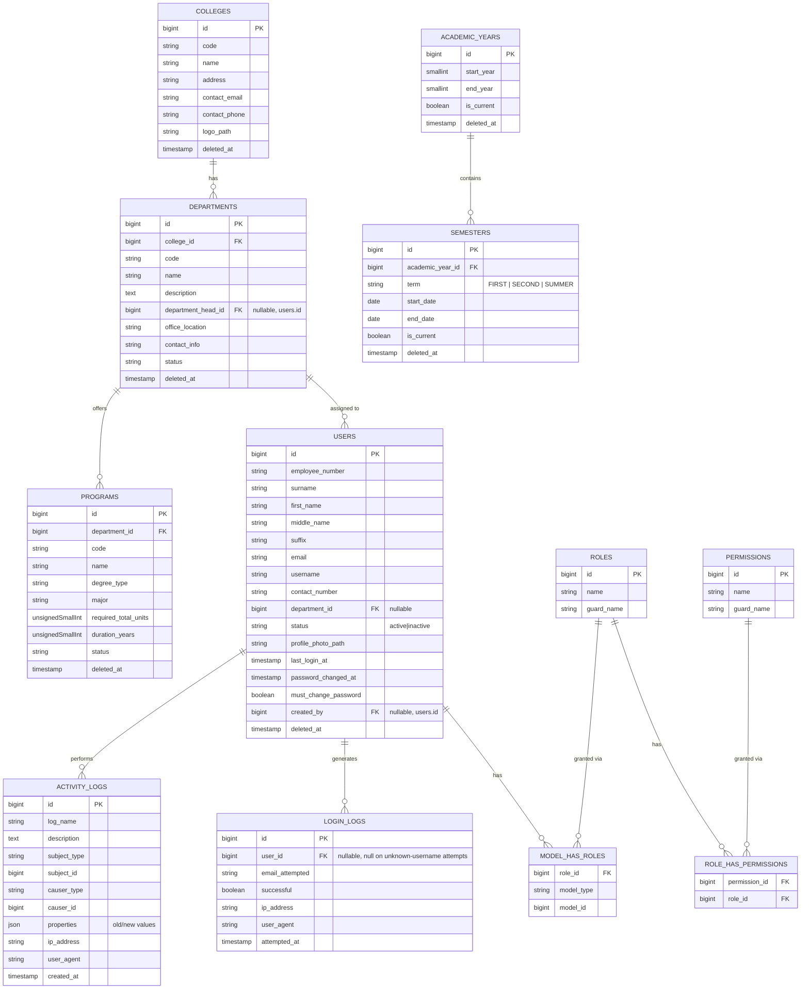
```mermaid
erDiagram
    COLLEGES ||--o{ DEPARTMENTS : has
    DEPARTMENTS ||--o{ PROGRAMS : offers
    DEPARTMENTS ||--o{ USERS : "assigned to"
    USERS ||--o{ MODEL_HAS_ROLES : has
    ROLES ||--o{ MODEL_HAS_ROLES : "granted via"
    ROLES ||--o{ ROLE_HAS_PERMISSIONS : has
    PERMISSIONS ||--o{ ROLE_HAS_PERMISSIONS : "granted via"
    USERS ||--o{ LOGIN_LOGS : generates
    USERS ||--o{ ACTIVITY_LOGS : performs
    ACADEMIC_YEARS ||--o{ SEMESTERS : contains

    COLLEGES {
        bigint id PK
        string code
        string name
        string address
        string contact_email
        string contact_phone
        string logo_path
        timestamp deleted_at
    }
    DEPARTMENTS {
        bigint id PK
        bigint college_id FK
        string code
        string name
        text description
        bigint department_head_id FK "nullable, users.id"
        string office_location
        string contact_info
        string status
        timestamp deleted_at
    }
    PROGRAMS {
        bigint id PK
        bigint department_id FK
        string code
        string name
        string degree_type
        string major
        unsignedSmallInt required_total_units
        unsignedSmallInt duration_years
        string status
        timestamp deleted_at
    }
    ACADEMIC_YEARS {
        bigint id PK
        smallint start_year
        smallint end_year
        boolean is_current
        timestamp deleted_at
    }
    SEMESTERS {
        bigint id PK
        bigint academic_year_id FK
        string term  "FIRST | SECOND | SUMMER"
        date start_date
        date end_date
        boolean is_current
        timestamp deleted_at
    }
    USERS {
        bigint id PK
        string employee_number
        string surname
        string first_name
        string middle_name
        string suffix
        string email
        string username
        string contact_number
        bigint department_id FK "nullable"
        string status "active|inactive"
        string profile_photo_path
        timestamp last_login_at
        timestamp password_changed_at
        boolean must_change_password
        bigint created_by FK "nullable, users.id"
        timestamp deleted_at
    }
    ROLES {
        bigint id PK
        string name
        string guard_name
    }
    PERMISSIONS {
        bigint id PK
        string name
        string guard_name
    }
    MODEL_HAS_ROLES {
        bigint role_id FK
        string model_type
        bigint model_id
    }
    ROLE_HAS_PERMISSIONS {
        bigint permission_id FK
        bigint role_id FK
    }
    LOGIN_LOGS {
        bigint id PK
        bigint user_id FK "nullable, null on unknown-username attempts"
        string email_attempted
        boolean successful
        string ip_address
        string user_agent
        timestamp attempted_at
    }
    ACTIVITY_LOGS {
        bigint id PK
        string log_name
        text description
        string subject_type
        bigint subject_id
        string causer_type
        bigint causer_id
        json properties "old/new values"
        string ip_address
        string user_agent
        timestamp created_at
    }
```

`roles`, `permissions`, `model_has_roles`, `model_has_permissions`, `role_has_permissions`
are generated by `spatie/laravel-permission`'s own migration; the shapes above are documented
for completeness, not hand-written. `activity_logs` is generated by
`spatie/laravel-activitylog`'s migration (with `event`, `batch_uuid` columns in addition to
the ones shown); `login_logs` is a small custom table since Spatie's package does not track
failed-login attempts.

## Phase 2 ERD

Two diagrams for readability: academic structure (curriculum/courses/students) and the
enrollment→grading pipeline. Scoping notes vs. the original table list are called out below
the diagrams.

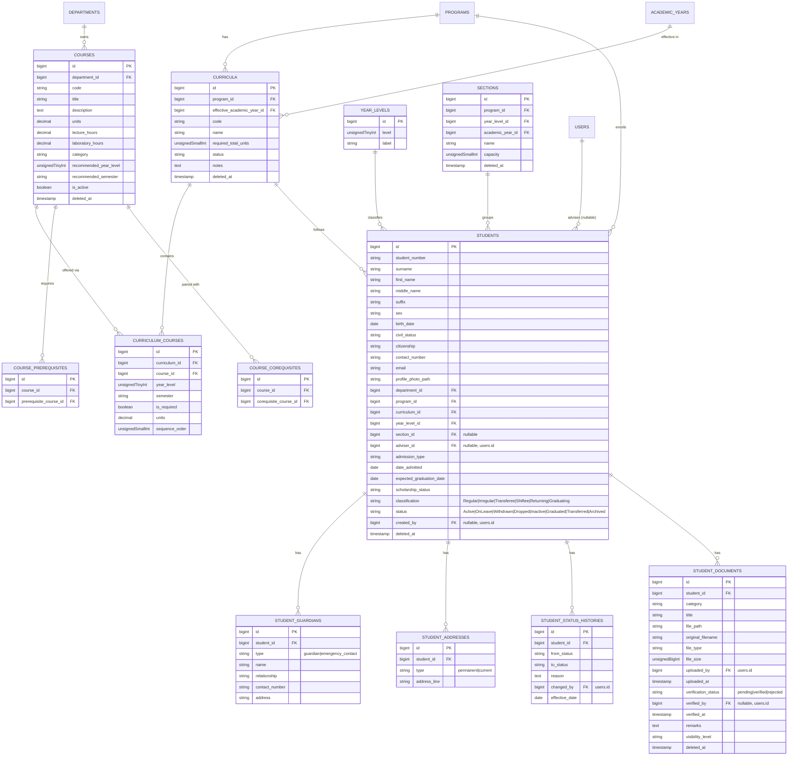
```mermaid
erDiagram
    PROGRAMS ||--o{ CURRICULA : has
    ACADEMIC_YEARS ||--o{ CURRICULA : "effective in"
    CURRICULA ||--o{ CURRICULUM_COURSES : contains
    COURSES ||--o{ CURRICULUM_COURSES : "offered via"
    COURSES ||--o{ COURSE_PREREQUISITES : requires
    COURSES ||--o{ COURSE_COREQUISITES : "paired with"
    DEPARTMENTS ||--o{ COURSES : owns
    PROGRAMS ||--o{ STUDENTS : enrolls
    CURRICULA ||--o{ STUDENTS : follows
    YEAR_LEVELS ||--o{ STUDENTS : "classifies"
    SECTIONS ||--o{ STUDENTS : groups
    USERS ||--o{ STUDENTS : "advises (nullable)"
    STUDENTS ||--o{ STUDENT_GUARDIANS : has
    STUDENTS ||--o{ STUDENT_ADDRESSES : has
    STUDENTS ||--o{ STUDENT_STATUS_HISTORIES : has
    STUDENTS ||--o{ STUDENT_DOCUMENTS : has

    CURRICULA {
        bigint id PK
        bigint program_id FK
        bigint effective_academic_year_id FK
        string code
        string name
        unsignedSmallInt required_total_units
        string status
        text notes
        timestamp deleted_at
    }
    COURSES {
        bigint id PK
        bigint department_id FK
        string code
        string title
        text description
        decimal units
        decimal lecture_hours
        decimal laboratory_hours
        string category
        unsignedTinyInt recommended_year_level
        string recommended_semester
        boolean is_active
        timestamp deleted_at
    }
    CURRICULUM_COURSES {
        bigint id PK
        bigint curriculum_id FK
        bigint course_id FK
        unsignedTinyInt year_level
        string semester
        boolean is_required
        decimal units
        unsignedSmallInt sequence_order
    }
    COURSE_PREREQUISITES {
        bigint id PK
        bigint course_id FK
        bigint prerequisite_course_id FK
    }
    COURSE_COREQUISITES {
        bigint id PK
        bigint course_id FK
        bigint corequisite_course_id FK
    }
    YEAR_LEVELS {
        bigint id PK
        unsignedTinyInt level
        string label
    }
    SECTIONS {
        bigint id PK
        bigint program_id FK
        bigint year_level_id FK
        bigint academic_year_id FK
        string name
        unsignedSmallInt capacity
        timestamp deleted_at
    }
    STUDENTS {
        bigint id PK
        string student_number
        string surname
        string first_name
        string middle_name
        string suffix
        string sex
        date birth_date
        string civil_status
        string citizenship
        string contact_number
        string email
        string profile_photo_path
        bigint department_id FK
        bigint program_id FK
        bigint curriculum_id FK
        bigint year_level_id FK
        bigint section_id FK "nullable"
        bigint adviser_id FK "nullable, users.id"
        string admission_type
        date date_admitted
        date expected_graduation_date
        string scholarship_status
        string classification "Regular|Irregular|Transferee|Shiftee|Returning|Graduating"
        string status "Active|OnLeave|Withdrawn|Dropped|Inactive|Graduated|Transferred|Archived"
        bigint created_by FK "nullable, users.id"
        timestamp deleted_at
    }
    STUDENT_GUARDIANS {
        bigint id PK
        bigint student_id FK
        string type "guardian|emergency_contact"
        string name
        string relationship
        string contact_number
        string address
    }
    STUDENT_ADDRESSES {
        bigint id PK
        bigint student_id FK
        string type "permanent|current"
        string address_line
    }
    STUDENT_STATUS_HISTORIES {
        bigint id PK
        bigint student_id FK
        string from_status
        string to_status
        text reason
        bigint changed_by FK "users.id"
        date effective_date
    }
    STUDENT_DOCUMENTS {
        bigint id PK
        bigint student_id FK
        string category
        string title
        string file_path
        string original_filename
        string file_type
        unsignedBigInt file_size
        bigint uploaded_by FK "users.id"
        timestamp uploaded_at
        string verification_status "pending|verified|rejected"
        bigint verified_by FK "nullable, users.id"
        timestamp verified_at
        text remarks
        string visibility_level
        timestamp deleted_at
    }
```

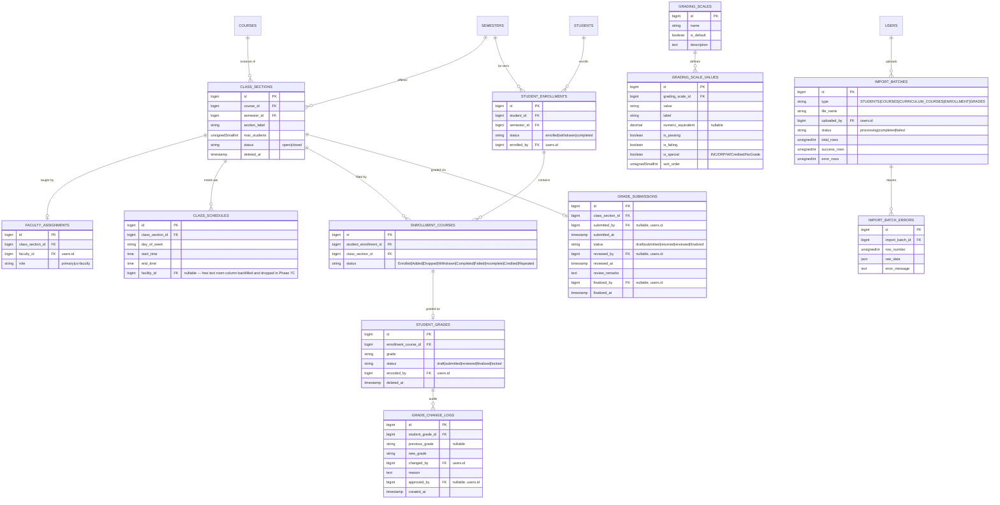
```mermaid
erDiagram
    SEMESTERS ||--o{ CLASS_SECTIONS : offered
    COURSES ||--o{ CLASS_SECTIONS : "instance of"
    CLASS_SECTIONS ||--o| FACULTY_ASSIGNMENTS : "taught by"
    CLASS_SECTIONS ||--o{ CLASS_SCHEDULES : "meets per"
    STUDENTS ||--o{ STUDENT_ENROLLMENTS : enrolls
    SEMESTERS ||--o{ STUDENT_ENROLLMENTS : "for term"
    STUDENT_ENROLLMENTS ||--o{ ENROLLMENT_COURSES : contains
    CLASS_SECTIONS ||--o{ ENROLLMENT_COURSES : "filled by"
    ENROLLMENT_COURSES ||--o| STUDENT_GRADES : "graded as"
    CLASS_SECTIONS ||--o| GRADE_SUBMISSIONS : "graded via"
    STUDENT_GRADES ||--o{ GRADE_CHANGE_LOGS : audits
    GRADING_SCALES ||--o{ GRADING_SCALE_VALUES : defines
    USERS ||--o{ IMPORT_BATCHES : uploads
    IMPORT_BATCHES ||--o{ IMPORT_BATCH_ERRORS : reports

    CLASS_SECTIONS {
        bigint id PK
        bigint course_id FK
        bigint semester_id FK
        string section_label
        unsignedSmallInt max_students
        string status "open|closed"
        timestamp deleted_at
    }
    FACULTY_ASSIGNMENTS {
        bigint id PK
        bigint class_section_id FK
        bigint faculty_id FK "users.id"
        string role "primary|co-faculty"
    }
    CLASS_SCHEDULES {
        bigint id PK
        bigint class_section_id FK
        string day_of_week
        time start_time
        time end_time
        bigint facility_id FK "nullable — free text room column backfilled and dropped in Phase 7C"
    }
    STUDENT_ENROLLMENTS {
        bigint id PK
        bigint student_id FK
        bigint semester_id FK
        string status "enrolled|withdrawn|completed"
        bigint enrolled_by FK "users.id"
    }
    ENROLLMENT_COURSES {
        bigint id PK
        bigint student_enrollment_id FK
        bigint class_section_id FK
        string status "Enrolled|Added|Dropped|Withdrawn|Completed|Failed|Incomplete|Credited|Repeated"
    }
    STUDENT_GRADES {
        bigint id PK
        bigint enrollment_course_id FK
        string grade
        string status "draft|submitted|reviewed|finalized|locked"
        bigint encoded_by FK "users.id"
        timestamp deleted_at
    }
    GRADE_SUBMISSIONS {
        bigint id PK
        bigint class_section_id FK
        bigint submitted_by FK "nullable, users.id"
        timestamp submitted_at
        string status "draft|submitted|returned|reviewed|finalized"
        bigint reviewed_by FK "nullable, users.id"
        timestamp reviewed_at
        text review_remarks
        bigint finalized_by FK "nullable, users.id"
        timestamp finalized_at
    }
    GRADE_CHANGE_LOGS {
        bigint id PK
        bigint student_grade_id FK
        string previous_grade "nullable"
        string new_grade
        bigint changed_by FK "users.id"
        text reason
        bigint approved_by FK "nullable, users.id"
        timestamp created_at
    }
    GRADING_SCALES {
        bigint id PK
        string name
        boolean is_default
        text description
    }
    GRADING_SCALE_VALUES {
        bigint id PK
        bigint grading_scale_id FK
        string value
        string label
        decimal numeric_equivalent "nullable"
        boolean is_passing
        boolean is_failing
        boolean is_special "INC/DRP/W/Credited/NoGrade"
        unsignedSmallInt sort_order
    }
    IMPORT_BATCHES {
        bigint id PK
        string type "STUDENTS|COURSES|CURRICULUM_COURSES|ENROLLMENT|GRADES"
        string file_name
        bigint uploaded_by FK "users.id"
        string status "processing|completed|failed"
        unsignedInt total_rows
        unsignedInt success_rows
        unsignedInt error_rows
    }
    IMPORT_BATCH_ERRORS {
        bigint id PK
        bigint import_batch_id FK
        unsignedInt row_number
        json raw_data
        text error_message
    }
```

### Phase 2 scoping notes (see `ASSUMPTIONS.md` for the full reasoning)

- **No standalone `majors` table.** `programs.major` (shipped in Phase 1) already captures
  "BS Agriculture major in Crop Science" vs. "...major in Animal Science" as a field on the
  program, since in this institution a major is a named variant of one degree program, not an
  independently manageable catalog object.
- **`class_schedules.room` is free text in Phase 2**, not a `facilities` FK — the Facilities
  module doesn't exist until Phase 7. It becomes a real FK once that module ships, via a
  migration that backfills matched facility rows. **Fulfilled in Phase 7C** — see that section
  below.
- **`faculty_assignments` is a table, not a column on `class_sections`**, even though Phase 2
  only ever creates one row per section — Phase 5's workload aggregation reads from this
  table, so the shape is right from the start rather than needing a data migration later.
- **Grading scale is fully configurable** (`grading_scales` / `grading_scale_values`), per the
  explicit spec instruction not to hard-code one grading policy. `student_grades.grade` stores
  the scale value as a string; validity is checked against the *active* scale's values at the
  application layer, not a database constraint (so switching the active scale doesn't require
  a migration).

## Phase 3A: Progress Computation Engine

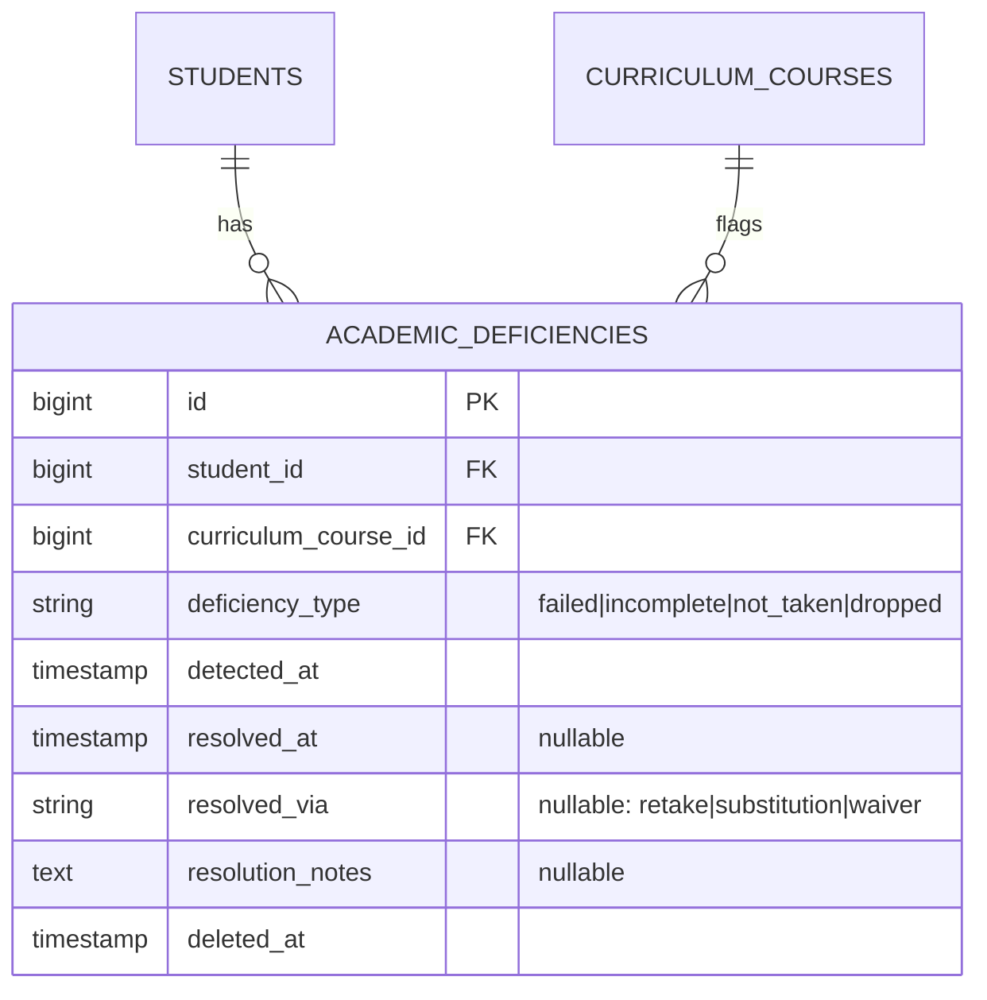
```mermaid
erDiagram
    STUDENTS ||--o{ ACADEMIC_DEFICIENCIES : has
    CURRICULUM_COURSES ||--o{ ACADEMIC_DEFICIENCIES : "flags"

    ACADEMIC_DEFICIENCIES {
        bigint id PK
        bigint student_id FK
        bigint curriculum_course_id FK
        string deficiency_type "failed|incomplete|not_taken|dropped"
        timestamp detected_at
        timestamp resolved_at "nullable"
        string resolved_via "nullable: retake|substitution|waiver"
        text resolution_notes "nullable"
        timestamp deleted_at
    }
```

### Phase 3A scoping notes (see `ASSUMPTIONS.md` for the full reasoning)

- **Checklist status and GWA are computed on demand, not cached** — `ProgressComputationService`
  walks the student's curriculum courses against their `enrollment_courses`/`student_grades`
  every time the Progress page loads. `academic_deficiencies` is the one piece that *is*
  persisted, because a deficiency needs a resolution workflow (retake/substitution/waiver, with
  notes) to attach to — a plain computed value has nothing to attach a resolution to.
- **"GWA" (General Weighted Average), not "GPA"** — the seeded grading scale is the Philippine
  1.00 (highest) – 5.00 (lowest) convention already established in Phase 2A, so a lower average
  is better. Calling it "GPA" would misrepresent the scale's direction to anyone used to a
  higher-is-better system.
- **A deficiency only exists for a course whose expected year level has already passed** —
  `curriculum_courses.year_level < student.year_level (current)`. A required course still ahead
  of the student on their curriculum is "pending," not a deficiency, even if `not_taken`.
- **The best attempt wins, not the latest.** If a student failed a course once and passed it on
  a later retake, the checklist shows `completed` — the failed attempt still exists in
  `student_grades`/`grade_change_logs` for audit purposes, it just doesn't drive the checklist
  status once superseded.

## Phase 3B: Advising Records

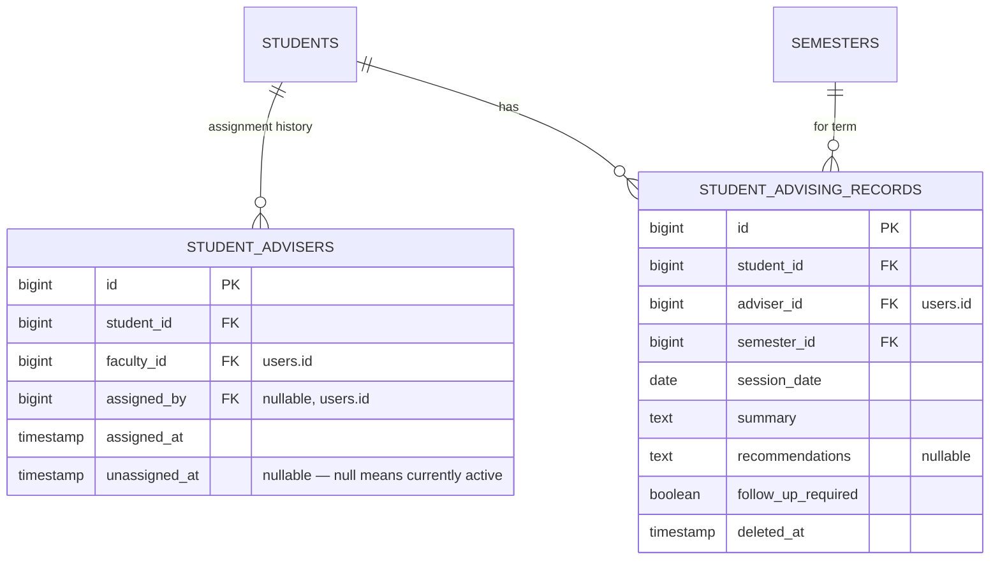
```mermaid
erDiagram
    STUDENTS ||--o{ STUDENT_ADVISERS : "assignment history"
    STUDENTS ||--o{ STUDENT_ADVISING_RECORDS : has
    SEMESTERS ||--o{ STUDENT_ADVISING_RECORDS : "for term"

    STUDENT_ADVISERS {
        bigint id PK
        bigint student_id FK
        bigint faculty_id FK "users.id"
        bigint assigned_by FK "nullable, users.id"
        timestamp assigned_at
        timestamp unassigned_at "nullable — null means currently active"
    }
    STUDENT_ADVISING_RECORDS {
        bigint id PK
        bigint student_id FK
        bigint adviser_id FK "users.id"
        bigint semester_id FK
        date session_date
        text summary
        text recommendations "nullable"
        boolean follow_up_required
        timestamp deleted_at
    }
```

### Phase 3B scoping notes (see `ASSUMPTIONS.md` for the full reasoning)

- **`students.adviser_id` (built in Phase 2C) remains the single editable field for adviser
  assignment.** `student_advisers` is a read-only history log, auto-written by a `Student` model
  event exactly like `student_status_histories` already does for status changes — there is no
  separate "assign adviser" form. Reassigning closes the previously-active row
  (`unassigned_at = now()`) and opens a new one; only one row per student may have
  `unassigned_at IS NULL` at a time, enforced at the application layer.
- **`advising.manage` excludes the Dean role.** The spec explicitly scopes "record
  advising/intervention" to Admin/Department Head/Faculty only — Dean gets `advising.view` for
  college-wide oversight but never creates or edits a session record.

## Phase 3C: At-Risk Monitoring

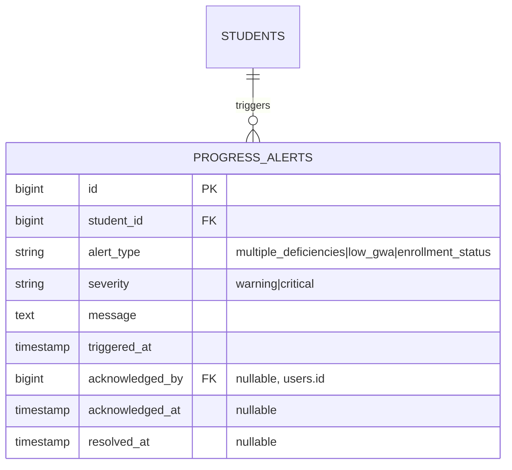
```mermaid
erDiagram
    STUDENTS ||--o{ PROGRESS_ALERTS : triggers

    PROGRESS_ALERTS {
        bigint id PK
        bigint student_id FK
        string alert_type "multiple_deficiencies|low_gwa|enrollment_status"
        string severity "warning|critical"
        text message
        timestamp triggered_at
        bigint acknowledged_by FK "nullable, users.id"
        timestamp acknowledged_at "nullable"
        timestamp resolved_at "nullable"
    }
```

### Phase 3C scoping notes (see `ASSUMPTIONS.md` for the full reasoning)

- **Three fixed rules, each independently evaluated and independently resolved**, unique per
  `(student_id, alert_type)`: 2+ unresolved deficiencies (4+ escalates to critical); GWA at or
  above 3.00 — the last passing value on the seeded scale — with 4.00+ (failing range)
  escalating to critical; and a student status of `on_leave`/`inactive` (warning) or `withdrawn`
  (critical). `ProgressAlertService::evaluate()` is the single place these thresholds live.
- **Re-syncing is scoped, not global.** The at-risk list (`/academic-progress`) re-evaluates
  every student *within the viewer's own visibility scope* (a Faculty member's advisees, a
  Department Head's department, or the whole college for Admin/Dean) on each visit, rather than
  running against every student in the database or on a schedule — see `ASSUMPTIONS.md` for the
  scale tradeoff this implies.
- **An alert that re-triggers after being resolved needs to be acknowledged again.** Resolving
  an alert does not delete it (so its history survives), and `syncAlerts()` clears
  `acknowledged_by`/`acknowledged_at` specifically when re-opening a previously-resolved row —
  otherwise a brand-new occurrence of the same alert type would silently inherit "already
  reviewed" status from whatever caused the *last* occurrence.

## Phase 3D: Intervention Follow-ups

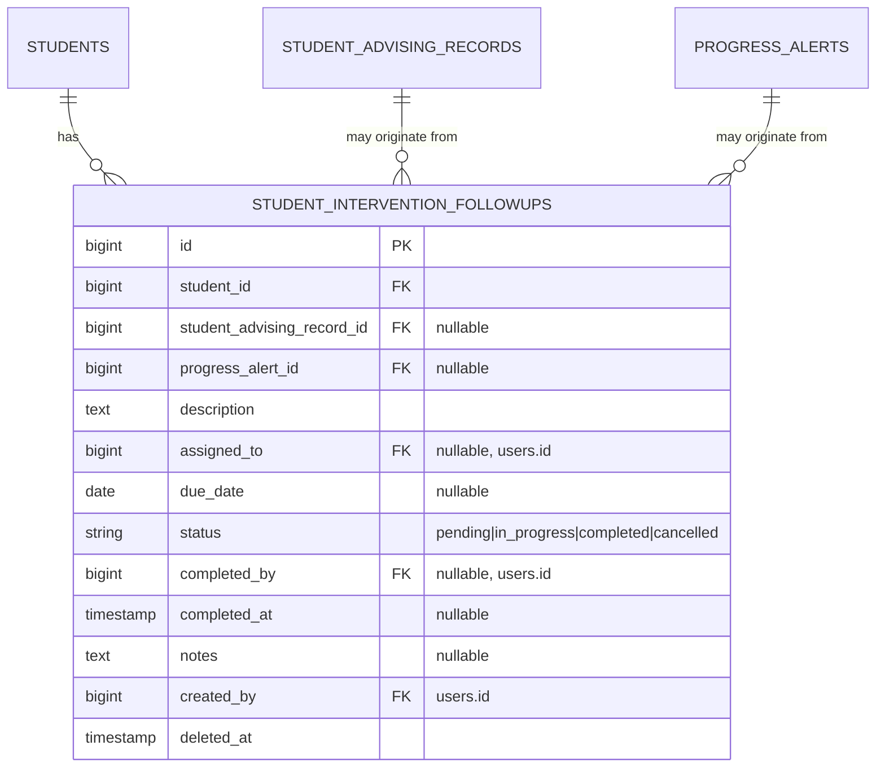
```mermaid
erDiagram
    STUDENTS ||--o{ STUDENT_INTERVENTION_FOLLOWUPS : has
    STUDENT_ADVISING_RECORDS ||--o{ STUDENT_INTERVENTION_FOLLOWUPS : "may originate from"
    PROGRESS_ALERTS ||--o{ STUDENT_INTERVENTION_FOLLOWUPS : "may originate from"

    STUDENT_INTERVENTION_FOLLOWUPS {
        bigint id PK
        bigint student_id FK
        bigint student_advising_record_id FK "nullable"
        bigint progress_alert_id FK "nullable"
        text description
        bigint assigned_to FK "nullable, users.id"
        date due_date "nullable"
        string status "pending|in_progress|completed|cancelled"
        bigint completed_by FK "nullable, users.id"
        timestamp completed_at "nullable"
        text notes "nullable"
        bigint created_by FK "users.id"
        timestamp deleted_at
    }
```

### Phase 3D scoping notes (see `ASSUMPTIONS.md` for the full reasoning)

- **Reuses `advising.manage`/`advising.view`, no new permission.** The spec groups "record
  advising/intervention" as one capability, not two — `StudentInterventionFollowupPolicy` mirrors
  `StudentAdvisingRecordPolicy` exactly (Admin unrestricted, Department Head own department,
  Faculty own advisees), with one addition: whoever a follow-up is `assigned_to` can also update
  it, even if they aren't the student's adviser (e.g. a tutor asked to handle one task).
- **`student_advising_record_id` and `progress_alert_id` are both nullable and independent** — a
  follow-up can originate from an advising session, an at-risk alert, or be created standalone
  with no source at all. Neither is required.
- **"Progress report" is the existing consolidated Progress page, not a new document.** Phase 3D
  adds a browser-print affordance (`window.print()` plus `print:hidden` on chrome/action
  controls) rather than a generated PDF — `barryvdh/laravel-dompdf` is explicitly scoped to
  Phase 4 in `PROJECT_PLAN.md`'s technology table, so introducing PDF generation here would jump
  ahead of the plan for a capability nothing in Phase 3 actually requires.

## Phase 4A: Graduation Candidate Identification and Requirements

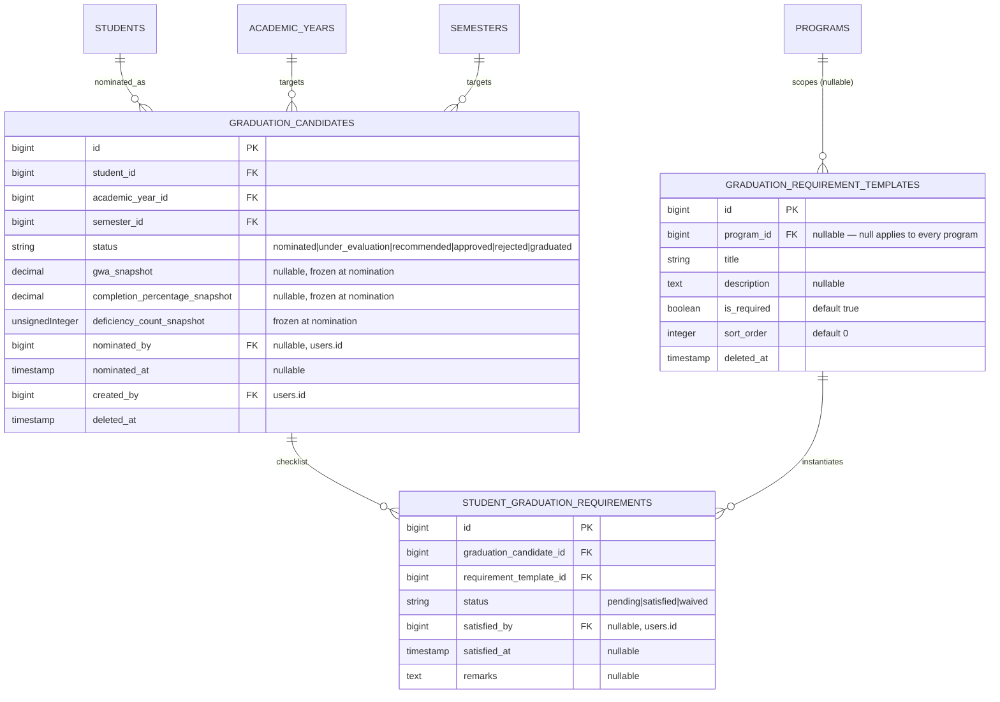
```mermaid
erDiagram
    STUDENTS ||--o{ GRADUATION_CANDIDATES : nominated_as
    ACADEMIC_YEARS ||--o{ GRADUATION_CANDIDATES : targets
    SEMESTERS ||--o{ GRADUATION_CANDIDATES : targets
    PROGRAMS ||--o{ GRADUATION_REQUIREMENT_TEMPLATES : "scopes (nullable)"
    GRADUATION_CANDIDATES ||--o{ STUDENT_GRADUATION_REQUIREMENTS : checklist
    GRADUATION_REQUIREMENT_TEMPLATES ||--o{ STUDENT_GRADUATION_REQUIREMENTS : instantiates

    GRADUATION_CANDIDATES {
        bigint id PK
        bigint student_id FK
        bigint academic_year_id FK
        bigint semester_id FK
        string status "nominated|under_evaluation|recommended|approved|rejected|graduated"
        decimal gwa_snapshot "nullable, frozen at nomination"
        decimal completion_percentage_snapshot "nullable, frozen at nomination"
        unsignedInteger deficiency_count_snapshot "frozen at nomination"
        bigint nominated_by FK "nullable, users.id"
        timestamp nominated_at "nullable"
        bigint created_by FK "users.id"
        timestamp deleted_at
    }

    GRADUATION_REQUIREMENT_TEMPLATES {
        bigint id PK
        bigint program_id FK "nullable — null applies to every program"
        string title
        text description "nullable"
        boolean is_required "default true"
        integer sort_order "default 0"
        timestamp deleted_at
    }

    STUDENT_GRADUATION_REQUIREMENTS {
        bigint id PK
        bigint graduation_candidate_id FK
        bigint requirement_template_id FK
        string status "pending|satisfied|waived"
        bigint satisfied_by FK "nullable, users.id"
        timestamp satisfied_at "nullable"
        text remarks "nullable"
    }
```

### Phase 4A scoping notes (see `ASSUMPTIONS.md` for the full reasoning)

- **`gwa_snapshot`, `completion_percentage_snapshot`, and `deficiency_count_snapshot` are
  deliberately frozen at nomination time — the one exception to this project's "compute on
  demand, never persist" rule** established in Phase 3A. A graduation record must not silently
  drift if a grade is edited months after nomination; the live, current values are always
  reachable via the existing Progress page (`View Progress` link on the candidate show page),
  so nothing is lost by freezing the graduation-record copy.
- **No `graduation_evaluations` table.** `GraduationCandidate.status` is the single umbrella
  status field carrying a candidate from `nominated` through `graduated` — the same
  no-redundant-status-table approach used for `student_progress_snapshots` in Phase 3A. Phase
  4B–4D advance this same `status` column rather than introducing a parallel evaluation-state
  table.
- **`graduation.view`/`graduation.manage` cover both requirement templates and candidates.**
  Dean and Department Head get `.view` only in 4A (their recommend/approve involvement starts
  in Phase 4C); only Administrator gets `.manage`, and `GraduationCandidatePolicy`/
  `GraduationRequirementTemplatePolicy` additionally hard-require the Administrator role on
  every mutating action — Phase 4 spec treats "preparation" (nominate, edit checklist) as
  Admin-only, distinct from "recommend" (Dept Head) and "approve" (Dean) in later sub-phases.
- **Eligibility is computed, not stored.** `GraduationCandidateService::identifyEligibleStudents()`
  filters active students to those with `ProgressComputationService::completionPercentage() ===
  100.0` and zero unresolved `academic_deficiencies` — reusing Phase 3A's engine rather than
  duplicating checklist logic.
- **`student_graduation_requirements` uses custom short FK constraint names**
  (`grad_requirements_candidate_fk`, `grad_requirements_template_fk`), proactively applying the
  64-character MySQL identifier limit lesson learned in Phase 3D.

## Phase 4B: Competency Evaluation

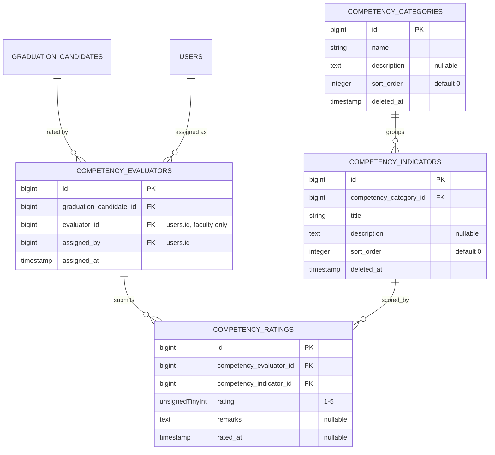
```mermaid
erDiagram
    COMPETENCY_CATEGORIES ||--o{ COMPETENCY_INDICATORS : groups
    GRADUATION_CANDIDATES ||--o{ COMPETENCY_EVALUATORS : "rated by"
    USERS ||--o{ COMPETENCY_EVALUATORS : "assigned as"
    COMPETENCY_EVALUATORS ||--o{ COMPETENCY_RATINGS : submits
    COMPETENCY_INDICATORS ||--o{ COMPETENCY_RATINGS : scored_by

    COMPETENCY_CATEGORIES {
        bigint id PK
        string name
        text description "nullable"
        integer sort_order "default 0"
        timestamp deleted_at
    }

    COMPETENCY_INDICATORS {
        bigint id PK
        bigint competency_category_id FK
        string title
        text description "nullable"
        integer sort_order "default 0"
        timestamp deleted_at
    }

    COMPETENCY_EVALUATORS {
        bigint id PK
        bigint graduation_candidate_id FK
        bigint evaluator_id FK "users.id, faculty only"
        bigint assigned_by FK "users.id"
        timestamp assigned_at
    }

    COMPETENCY_RATINGS {
        bigint id PK
        bigint competency_evaluator_id FK
        bigint competency_indicator_id FK
        unsignedTinyInt rating "1-5"
        text remarks "nullable"
        timestamp rated_at "nullable"
    }
```

### Phase 4B scoping notes (see `ASSUMPTIONS.md` for the full reasoning)

- **Assigning a candidate's first evaluator transitions `GraduationCandidate.status` from
  `nominated` to `under_evaluation`** — the same "a meaningful action triggers the status"
  pattern used for adviser reassignment in Phase 3B, rather than a separate manual
  "start evaluation" step.
- **Evaluators must be Faculty from the same department as the candidate's student**, enforced
  in `CompetencyEvaluatorRequest`, not just the UI dropdown — a candidate cannot be assigned an
  evaluator from a different department or a non-Faculty role.
- **`GraduationCandidate::evaluationComplete()` is computed, not stored** — true only when at
  least one evaluator is assigned and every assigned evaluator has a `competency_ratings` row
  for every currently-defined `competency_indicators` row. Mirrors `requirementsComplete()`
  from Phase 4A.
- **`graduation.view`/`graduation.manage` are extended to cover the competency framework too**
  (categories, indicators), and a new `graduation.evaluate` permission is introduced,
  granted to Faculty only — the capability to submit ratings for a candidate they are assigned
  to, checked in `CompetencyRatingRequest` against the specific `competency_evaluators` row,
  not just role membership.
- **`GraduationCandidate::scopeVisibleTo()` and `GraduationCandidatePolicy::view()` are extended
  for Faculty**: rather than a separate "My Evaluations" page, Faculty now sees the same
  `/graduation-candidates` index and show page as every other role, scoped to only the
  candidates where they hold a `competency_evaluators` row — reusing the existing candidate
  list/detail UI instead of building a parallel one.

## Phase 4C: Department Recommendation and Dean Approval

No new tables. Six columns were added to `graduation_candidates` directly instead of the
originally-planned separate `graduation_recommendations`/`graduation_approvals` tables (see the
scoping note below):

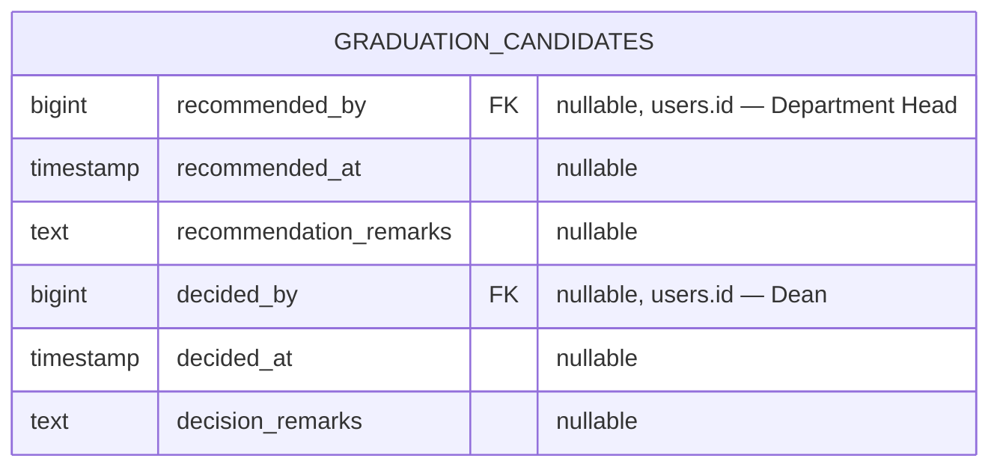
```mermaid
erDiagram
    GRADUATION_CANDIDATES {
        bigint recommended_by FK "nullable, users.id — Department Head"
        timestamp recommended_at "nullable"
        text recommendation_remarks "nullable"
        bigint decided_by FK "nullable, users.id — Dean"
        timestamp decided_at "nullable"
        text decision_remarks "nullable"
    }
```

### Phase 4C scoping notes (see `ASSUMPTIONS.md` for the full reasoning)

- **No `graduation_recommendations`/`graduation_approvals` tables**, despite both appearing on
  the original Phase 1 forward-looking table list. A candidate receives at most one
  recommendation and one decision each — a rejected candidacy is terminal (a fresh attempt is a
  brand-new `GraduationCandidate` row per the Phase 4A nomination rules), so there is nothing a
  one-row-per-candidate child table would capture that six nullable columns on
  `graduation_candidates` don't already, and `LogsActivity` already gives an audit trail of the
  field changes. Same "don't build a table nothing needs yet" reasoning as skipping
  `graduation_evaluations` in Phase 4A.
- **`recommend`/`decide` are dedicated Policy abilities on `GraduationCandidatePolicy`**, not new
  permissions — both reuse the `graduation.view` grant Department Head and Dean already hold,
  narrowed by role and (for Department Head) department match. `graduation.manage` is
  deliberately *not* involved: recommending/approving are the Department Head's and Dean's own
  judgment calls, not an Admin "management" action, mirroring how Phase 4A excluded Admin from
  needing to touch nomination-adjacent decisions reserved for other roles.
- **Recommending requires `GraduationCandidate::readyForRecommendation()`**
  (`requirementsComplete() && evaluationComplete()`), enforced server-side in
  `GraduationRecommendationService`, not just hidden via the UI.

## Phase 4D: Graduation Reports (PDF) and Phase 4 Wrap-up

No new tables. One column added to `graduation_candidates`:

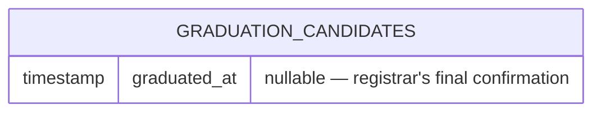
```mermaid
erDiagram
    GRADUATION_CANDIDATES {
        timestamp graduated_at "nullable — registrar's final confirmation"
    }
```

`barryvdh/laravel-dompdf` is introduced here — the first PDF dependency in the project, per the
technology table above. Reports are plain Blade views (`resources/views/pdf/*.blade.php`), not
Inertia pages, since dompdf renders server-side HTML to PDF independently of the SPA.

### Phase 4D scoping notes (see `ASSUMPTIONS.md` for the full reasoning)

- **`GraduationCandidateStatus::Graduated` is a distinct, separately-confirmed final step**, not
  automatic on Dean approval. `GraduationRecommendationService::markGraduated()` requires
  `status === Approved` and is Admin-only (reuses the `update` gate — a registrar-style final
  confirmation, treated as another edit to the candidate record, same reuse pattern as evaluator
  assignment in Phase 4B).
- **No new permission or table for conferral** — `graduated_at` is the only addition, following
  the same "don't build more than a workflow needs" reasoning as Phase 4A/4C.
- **Two report shapes, no new tables for either**: an individual per-candidate report
  (`GraduationReportController@show`, streamed inline) reusing the same `view` authorization as
  the candidate page itself; and a batch graduation-list report
  (`GraduationReportController@batch`, downloaded) scoped by the existing
  `GraduationCandidate::scopeVisibleTo()` — so a Department Head downloading the batch list only
  ever sees their own department's `approved`/`graduated` candidates for the requested term,
  with no separate report-specific authorization logic needed.

## Phase 5A: Faculty Profile Core

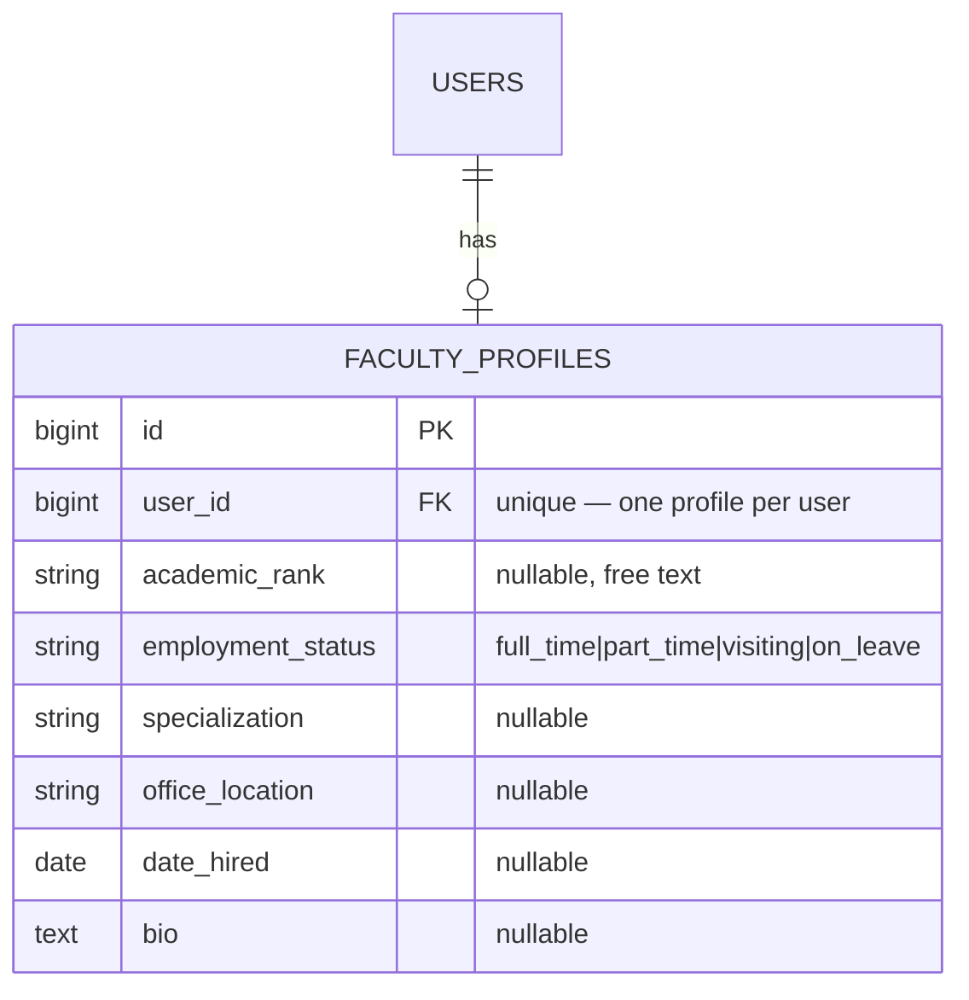
```mermaid
erDiagram
    USERS ||--o| FACULTY_PROFILES : has

    FACULTY_PROFILES {
        bigint id PK
        bigint user_id FK "unique — one profile per user"
        string academic_rank "nullable, free text"
        string employment_status "full_time|part_time|visiting|on_leave"
        string specialization "nullable"
        string office_location "nullable"
        date date_hired "nullable"
        text bio "nullable"
    }
```

### Phase 5A scoping notes (see `ASSUMPTIONS.md` for the full reasoning)

- **`faculty_profiles` rows are lazily created, not provisioned when a Faculty account is
  made.** `FacultyProfileController` calls `FacultyProfile::firstOrCreate(['user_id' => ...])`
  on first view/edit — no new-account hook, no empty-row backfill migration.
- **`academic_rank` is a free-text string, not an enum or lookup table.** Academic ranking
  schemes vary by institution and aren't specified anywhere in the spec, unlike the grading
  scale (which the spec explicitly calls out as configurable) — a plain string avoids
  hard-coding a ranking scheme the college may not actually use.
- **`employment_status` is a backed enum** (`full_time`/`part_time`/`visiting`/`on_leave`) —
  a genuinely fixed, small set, consistent with every other fixed-status field in this project.
- **New `faculty-profiles.manage`/`faculty-profiles.view` permissions**, with a field-level split
  enforced in `FacultyProfileRequest`: Admin (`.manage`) can edit every field; a Faculty member
  editing their own profile (no extra permission needed beyond `.view`, gated by
  `$profile->user_id === $user->id` in the policy) can only touch `specialization`,
  `office_location`, and `bio` — `academic_rank`/`employment_status`/`date_hired` are
  HR-controlled and silently excluded from a non-Admin request's validated data, not merely
  hidden in the UI.
- **`FacultyProfile::scopeVisibleTo()` mirrors the same three-tier scoping used everywhere
  else** (Admin/Dean unrestricted, Department Head own department via `user.department_id`,
  Faculty their own row only) — same shape as `GraduationCandidate::scopeVisibleTo()`.

## Phase 5B: Faculty Education, Credentials, Trainings, Awards

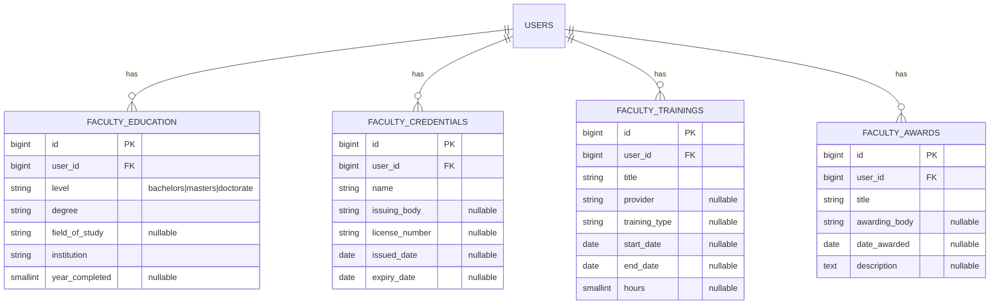
```mermaid
erDiagram
    USERS ||--o{ FACULTY_EDUCATION : has
    USERS ||--o{ FACULTY_CREDENTIALS : has
    USERS ||--o{ FACULTY_TRAININGS : has
    USERS ||--o{ FACULTY_AWARDS : has

    FACULTY_EDUCATION {
        bigint id PK
        bigint user_id FK
        string level "bachelors|masters|doctorate"
        string degree
        string field_of_study "nullable"
        string institution
        smallint year_completed "nullable"
    }

    FACULTY_CREDENTIALS {
        bigint id PK
        bigint user_id FK
        string name
        string issuing_body "nullable"
        string license_number "nullable"
        date issued_date "nullable"
        date expiry_date "nullable"
    }

    FACULTY_TRAININGS {
        bigint id PK
        bigint user_id FK
        string title
        string provider "nullable"
        string training_type "nullable"
        date start_date "nullable"
        date end_date "nullable"
        smallint hours "nullable"
    }

    FACULTY_AWARDS {
        bigint id PK
        bigint user_id FK
        string title
        string awarding_body "nullable"
        date date_awarded "nullable"
        text description "nullable"
    }
```

### Phase 5B scoping notes (see `ASSUMPTIONS.md` for the full reasoning)

- **All four tables key on `user_id` directly, not `faculty_profile_id`.** These records belong
  to the faculty member, not to the profile row (which is just one part of their record) —
  same "tie the record to the actual owner, not an intermediate container" choice already made
  for `student_documents` (Phase 2D), which keys on `student_id`, not some other wrapper.
- **These four resources are Admin-only to create/edit/delete — no Faculty self-edit**, unlike
  the core profile fields from Phase 5A. Education, credentials, trainings, and awards are
  treated as verifiable institutional records (transcripts, licenses, certificates of
  completion), not self-reported facts, so the same "faculty can edit some of their own record"
  carve-out from Phase 5A does not extend here. Dean/Department Head/Faculty all get read-only
  visibility through the same `faculty-profiles.view` permission and page.
- **`level` (education) is a backed enum** (`bachelors`/`masters`/`doctorate` — a small fixed
  set), while **`training_type` is a free string** (seminar/workshop/conference/etc. varies too
  much to enumerate) — the same enum-vs-string judgment call already applied to
  `employment_status` vs. `academic_rank` in Phase 5A.
- **No dedicated policies for `view`** on any of the four models — same as
  `StudentGraduationRequirement`/`CompetencyIndicator` in Phase 4, authorization for seeing a
  record is entirely handled by the parent `FacultyProfilePolicy::view()` check when the
  candidate's profile page loads; the child policies only define `create`/`update`/`delete`.

## Phase 5C: Faculty Documents

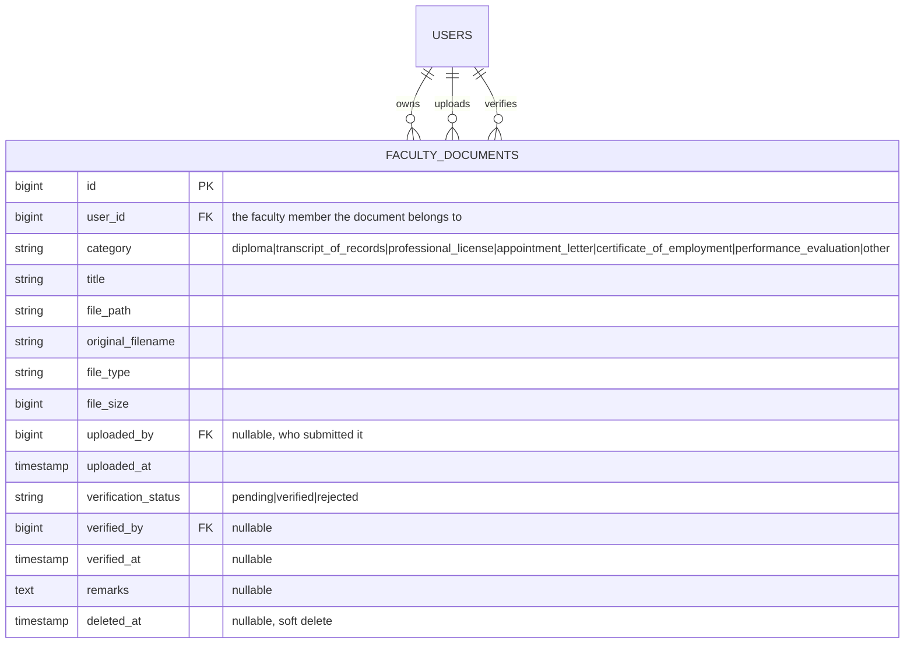
```mermaid
erDiagram
    USERS ||--o{ FACULTY_DOCUMENTS : owns
    USERS ||--o{ FACULTY_DOCUMENTS : uploads
    USERS ||--o{ FACULTY_DOCUMENTS : verifies

    FACULTY_DOCUMENTS {
        bigint id PK
        bigint user_id FK "the faculty member the document belongs to"
        string category "diploma|transcript_of_records|professional_license|appointment_letter|certificate_of_employment|performance_evaluation|other"
        string title
        string file_path
        string original_filename
        string file_type
        bigint file_size
        bigint uploaded_by FK "nullable, who submitted it"
        timestamp uploaded_at
        string verification_status "pending|verified|rejected"
        bigint verified_by FK "nullable"
        timestamp verified_at "nullable"
        text remarks "nullable"
        timestamp deleted_at "nullable, soft delete"
    }
```

### Phase 5C scoping notes (see `ASSUMPTIONS.md` for the full reasoning)

- **`faculty_documents` keys on `user_id` directly**, same as the four Phase 5B tables — the
  document belongs to the faculty member, not to the `faculty_profiles` row.
- **Three separate user references, three separate purposes**: `user_id` (whose document this
  is), `uploaded_by` (who submitted it — may be the faculty member themselves or an Admin),
  `verified_by` (which Admin reviewed it). All three can be different users at once (an Admin
  uploads on a faculty member's behalf, a different Admin later verifies it).
  `uploaded_by`/`verified_by` are `nullOnDelete()` so a deleted user account doesn't cascade
  away the historical document record.
- **`verification_status` reuses the `DocumentVerificationStatus` enum introduced in Phase 2D**
  for `student_documents` — same three-state shape (`pending`/`verified`/`rejected`), same
  reviewer/remarks pattern, no need for a parallel enum.
- **Unlike `student_documents`, there is no `visibility_level` column.** Student documents
  needed a visibility flag because of a (future) student self-service portal concept; faculty
  already authenticate directly into CA-APOMS with role-scoped visibility handled entirely by
  `scopeVisibleTo()`, so a separate per-document visibility flag would be a redundant axis of
  control with nothing to gate.
- **`FacultyDocument::scopeVisibleTo()` uses the same three-tier shape as `FacultyProfile`**
  (Admin/Dean unrestricted, Department Head own department via `user.department_id`, else
  self only).
- **Soft deletes** (`deleted_at`) are used here — unlike the Phase 5B tables — because a
  document's underlying file is physically removed from storage on delete
  (`FacultyDocumentController::destroy()`), and keeping the DB row as a tombstone preserves the
  audit trail (who deleted what, when) without the file itself lingering on disk.

## Phase 5D: Faculty Workload

No new tables. Teaching load is computed on demand from `faculty_assignments` (Phase 2E) joined
through `class_sections` → `courses` (for `units`) and `class_schedules` (for meeting times) —
see `App\Services\FacultyWorkloadService`. The `faculty_workloads`/`faculty_workload_items`
tables that appeared in earlier planning notes are **not built**, for the same reason
`graduation_recommendations`/`graduation_approvals` were dropped in Phase 4C: nothing in this
phase's scope needs a persisted workload record with its own lifecycle, and a stored total would
just be a cache that drifts the moment a class section's faculty assignment or course units
change.

### Phase 5D scoping notes (see `ASSUMPTIONS.md` for the full reasoning)

- **Every assigned section counts its full course unit value toward the assignee's total**,
  regardless of `faculty_assignments.role` (`primary` vs `co-faculty`) — no fractional split
  between co-faculty on the same section.
- **The workload dashboard (Department Head/Dean/Admin) starts from `users`, not
  `faculty_assignments`**, so a faculty member with zero assigned sections still appears with a
  `0.00` total — an under-loaded faculty member is exactly the kind of thing a workload review is
  for, so an assignment-first query that would silently omit them isn't used.
- **No `FacultyWorkloadPolicy` class.** There is no single Eloquent model this feature
  authorizes access to — it's an aggregate view over `faculty_assignments` scoped by role/
  department — so authorization is an inline permission + scope check in
  `FacultyWorkloadController`, the same precedent already set by `AdvisingController::index()`
  in Phase 3.

## Phase 6A: Announcements and Events

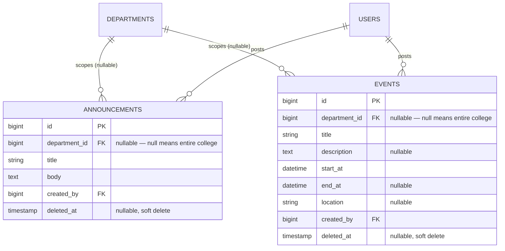
```mermaid
erDiagram
    DEPARTMENTS ||--o{ ANNOUNCEMENTS : "scopes (nullable)"
    USERS ||--o{ ANNOUNCEMENTS : posts
    DEPARTMENTS ||--o{ EVENTS : "scopes (nullable)"
    USERS ||--o{ EVENTS : posts

    ANNOUNCEMENTS {
        bigint id PK
        bigint department_id FK "nullable — null means entire college"
        string title
        text body
        bigint created_by FK
        timestamp deleted_at "nullable, soft delete"
    }

    EVENTS {
        bigint id PK
        bigint department_id FK "nullable — null means entire college"
        string title
        text description "nullable"
        datetime start_at
        datetime end_at "nullable"
        string location "nullable"
        bigint created_by FK
        timestamp deleted_at "nullable, soft delete"
    }
```

### Phase 6A scoping notes (see `ASSUMPTIONS.md` for the full reasoning)

- **`department_id` is nullable on both tables, and nullability itself is the scoping signal** —
  `null` means "entire college," a set value means "this department only." No separate
  `is_college_wide` boolean; the column already carries that meaning, the same "nullable FK as
  the scope signal" shape already used by `GraduationRequirementTemplate.program_id` (Phase 4A).
- **`Announcement`/`Event::scopeVisibleTo()`** — Admin/Dean unrestricted; everyone else sees rows
  where `department_id` is `null` OR matches their own `user.department_id`.
- **A Department Head's `department_id` is forced server-side in the FormRequest**, not merely
  hidden in the UI — the same field-level restriction pattern `FacultyProfileRequest` uses for
  Admin-only fields in Phase 5A. A Department Head can never post or reassign an item to another
  department or to the entire college, even by crafting a raw request.
- **Both tables soft-delete.** Unlike the Phase 5B qualification tables (which hard-delete, since
  they have no associated file and no downstream reference), an announcement or event may already
  be linked from a Phase 6F notification once that sub-phase exists; a tombstone avoids a
  dangling reference later.
- **`events.start_at`/`end_at` are stored and edited in the application's configured timezone
  (UTC) as plain wall-clock values** — the Edit form round-trips the exact value a user typed,
  with no drift. The read-only Index list, however, renders the stored UTC instant through the
  browser's `Date.prototype.toLocaleString()`, which converts to the *viewer's local timezone*
  for display. In a single-campus deployment where every viewer's OS clock is already set to the
  campus's own timezone, this coincides with wall-clock campus time; it was called out explicitly
  here rather than left implicit so it isn't mistaken for a bug later.

## Phase 6B: Meetings

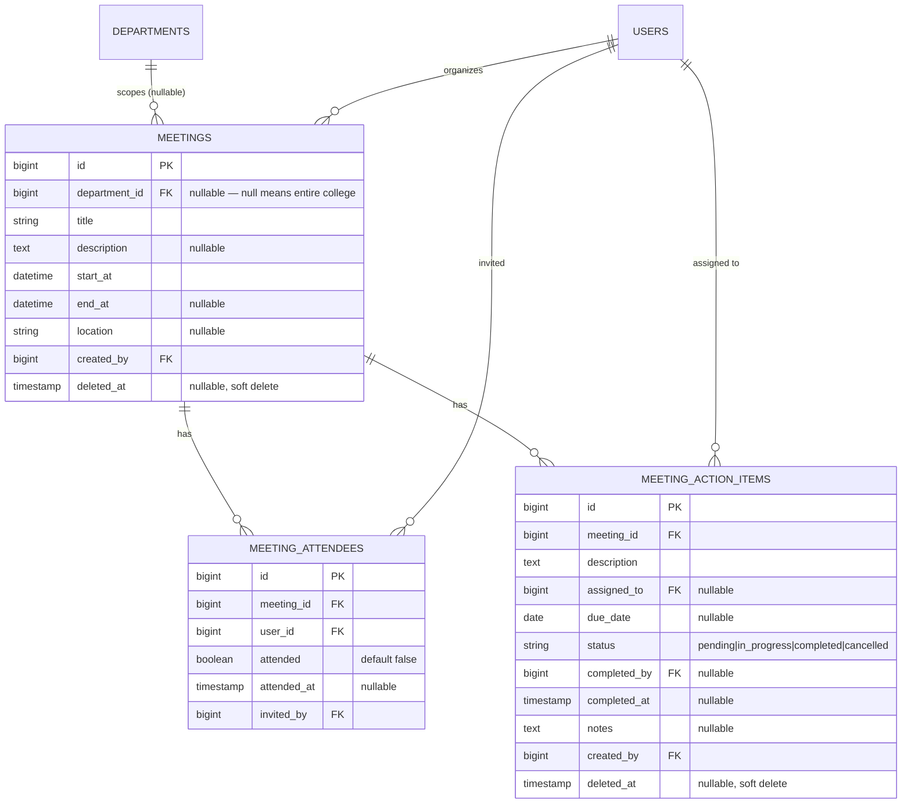
```mermaid
erDiagram
    DEPARTMENTS ||--o{ MEETINGS : "scopes (nullable)"
    USERS ||--o{ MEETINGS : organizes
    MEETINGS ||--o{ MEETING_ATTENDEES : has
    USERS ||--o{ MEETING_ATTENDEES : invited
    MEETINGS ||--o{ MEETING_ACTION_ITEMS : has
    USERS ||--o{ MEETING_ACTION_ITEMS : "assigned to"

    MEETINGS {
        bigint id PK
        bigint department_id FK "nullable — null means entire college"
        string title
        text description "nullable"
        datetime start_at
        datetime end_at "nullable"
        string location "nullable"
        bigint created_by FK
        timestamp deleted_at "nullable, soft delete"
    }

    MEETING_ATTENDEES {
        bigint id PK
        bigint meeting_id FK
        bigint user_id FK
        boolean attended "default false"
        timestamp attended_at "nullable"
        bigint invited_by FK
    }

    MEETING_ACTION_ITEMS {
        bigint id PK
        bigint meeting_id FK
        text description
        bigint assigned_to FK "nullable"
        date due_date "nullable"
        string status "pending|in_progress|completed|cancelled"
        bigint completed_by FK "nullable"
        timestamp completed_at "nullable"
        text notes "nullable"
        bigint created_by FK
        timestamp deleted_at "nullable, soft delete"
    }
```

### Phase 6B scoping notes (see `ASSUMPTIONS.md` for the full reasoning)

- **`meetings.department_id` is nullable with the same meaning as `announcements`/`events`**
  (Phase 6A): `null` = entire college, set = that department only. `Meeting::scopeVisibleTo()`
  and `MeetingPolicy` are structurally identical to `Announcement`/`Event`'s.
- **`meeting_attendees` has no soft delete** — removing an attendee (before the meeting, added in
  error) is a real deletion, not an archival; unlike `meeting_action_items`, nothing downstream
  references an attendee row that would need a tombstone.
- **`meeting_action_items` mirrors `student_intervention_followups` (Phase 3D) column-for-column**
  (`description`, `assigned_to`, `due_date`, `status`, `completed_by`, `completed_at`, `notes`,
  `created_by`) with `meeting_id` replacing `student_id`/`student_advising_record_id`/
  `progress_alert_id` as the parent reference — same trackable-work-item shape, different parent.
- **`status` uses a new `ActionItemStatus` enum**, not `InterventionStatus` — the states are
  identical (pending/in_progress/completed/cancelled), but `InterventionStatus` is named for the
  advising domain specifically. `ActionItemStatus` is named generically so `MeetingActionItem`
  (this phase) and `Task` (Phase 6C) can both use it, rather than each minting its own
  near-identical enum.

## Phase 6C: Tasks

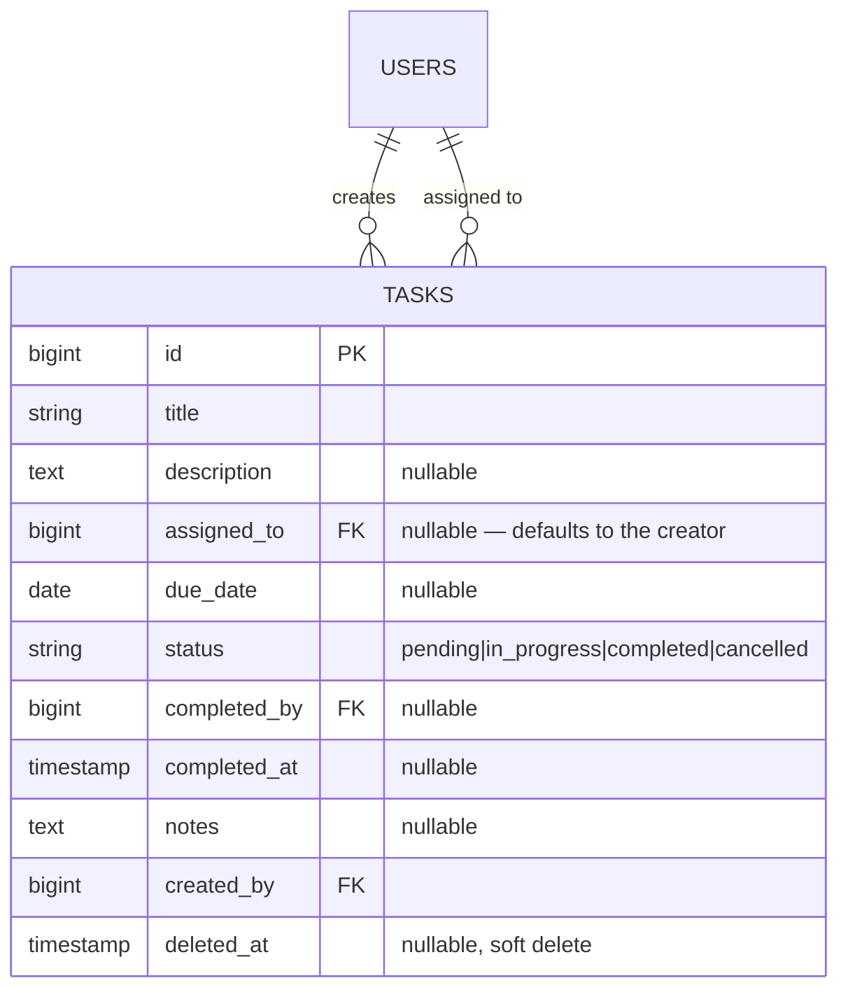
```mermaid
erDiagram
    USERS ||--o{ TASKS : creates
    USERS ||--o{ TASKS : "assigned to"

    TASKS {
        bigint id PK
        string title
        text description "nullable"
        bigint assigned_to FK "nullable — defaults to the creator"
        date due_date "nullable"
        string status "pending|in_progress|completed|cancelled"
        bigint completed_by FK "nullable"
        timestamp completed_at "nullable"
        text notes "nullable"
        bigint created_by FK
        timestamp deleted_at "nullable, soft delete"
    }
```

### Phase 6C scoping notes (see `ASSUMPTIONS.md` for the full reasoning)

- **No `department_id`.** Unlike every other Phase 6 table, a `Task` is a personal delegation
  between a creator and an assignee, not department-scoped operational content — there's nothing
  to scope by department.
- **Column shape mirrors `meeting_action_items` (Phase 6B) exactly**, minus `meeting_id`: same
  `assigned_to`/`due_date`/`status`/`completed_by`/`completed_at`/`notes`/`created_by` fields,
  same `ActionItemStatus` enum. A `Task` is a `MeetingActionItem` with no parent meeting.
- **`Task::scopeVisibleTo()` is creator-or-assignee, not department-based** — the only model in
  the schema so far scoped this way. Admin sees every task for oversight; everyone else sees only
  tasks where they are the creator or the assignee.

## Phase 6D: Internal Requests

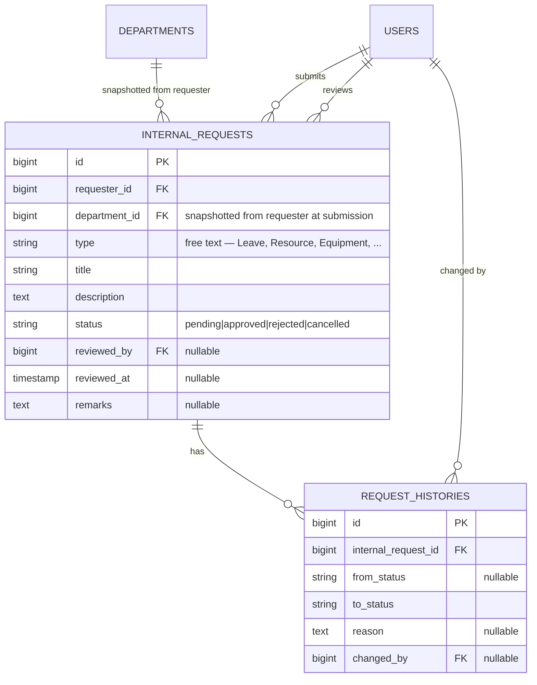
```mermaid
erDiagram
    USERS ||--o{ INTERNAL_REQUESTS : submits
    DEPARTMENTS ||--o{ INTERNAL_REQUESTS : "snapshotted from requester"
    USERS ||--o{ INTERNAL_REQUESTS : reviews
    INTERNAL_REQUESTS ||--o{ REQUEST_HISTORIES : has
    USERS ||--o{ REQUEST_HISTORIES : "changed by"

    INTERNAL_REQUESTS {
        bigint id PK
        bigint requester_id FK
        bigint department_id FK "snapshotted from requester at submission"
        string type "free text — Leave, Resource, Equipment, ..."
        string title
        text description
        string status "pending|approved|rejected|cancelled"
        bigint reviewed_by FK "nullable"
        timestamp reviewed_at "nullable"
        text remarks "nullable"
    }

    REQUEST_HISTORIES {
        bigint id PK
        bigint internal_request_id FK
        string from_status "nullable"
        string to_status
        text reason "nullable"
        bigint changed_by FK "nullable"
    }
```

### Phase 6D scoping notes (see `ASSUMPTIONS.md` for the full reasoning)

- **`request_histories` rows are written entirely by model events on `InternalRequest`**
  (`static::created()`/`static::updating()`), never by controller code directly — the same
  auto-write pattern `Student` (Phase 2C) uses for `student_status_histories`. A status change
  without a corresponding history row is structurally impossible, not just a convention.
- **`department_id` is a snapshot taken at submission, not a live join through `requester`** —
  same reasoning as every other department-scoped table in the schema (direct column beats a
  `whereHas` join for both query simplicity and stable `scopeVisibleTo()` behavior).
- **`type` is a free string, not an enum** — the set of request types is institution-specific and
  open-ended, the same judgment already applied to `training_type` (Phase 5B) and `academic_rank`
  (Phase 5A).
- **New `InternalRequestStatus` enum, not a reuse of `ActionItemStatus`.** The two enums are
  easy to conflate (both have a "pending" case) but mean different things: `ActionItemStatus` is
  a work-item lifecycle (pending → in progress → completed), while `InternalRequestStatus` is an
  approval outcome (pending → approved/rejected, or withdrawn via cancelled). Reusing one for the
  other would misrepresent what "pending" or "cancelled" means in context.
- **No `internal_requests.deleted_at`.** A request is never deleted, only transitioned to
  `cancelled` by its own requester — the row itself, and its full `request_histories` trail,
  remains as a permanent record either way.

## Phase 6E: Document Repository

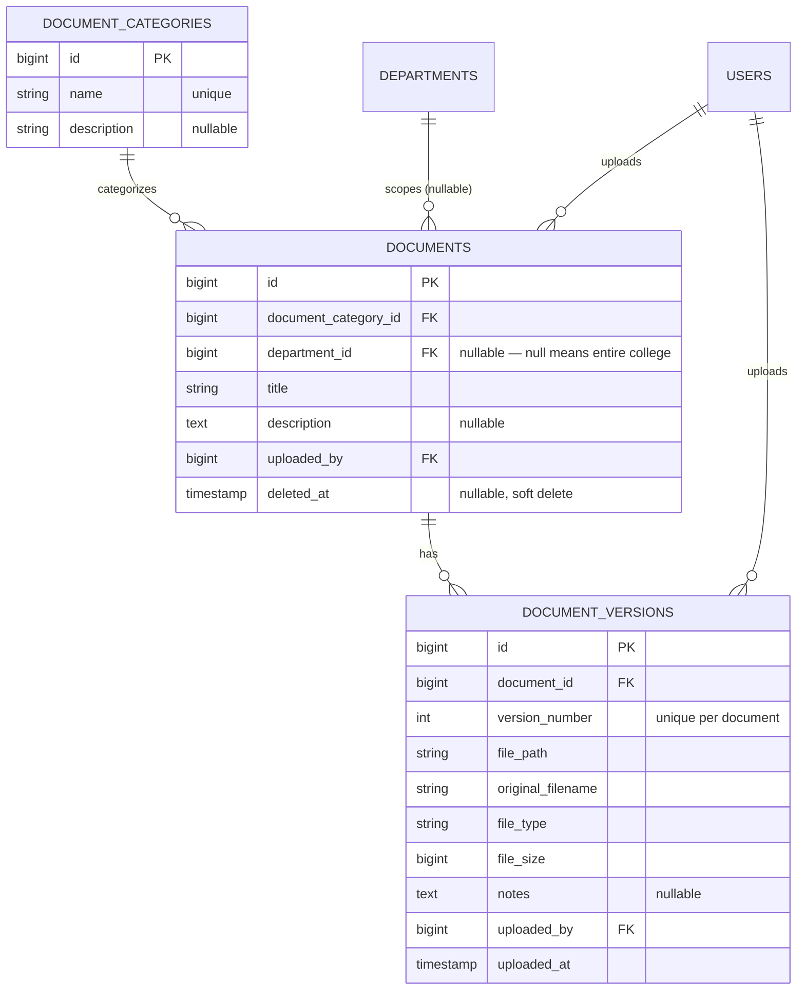
```mermaid
erDiagram
    DOCUMENT_CATEGORIES ||--o{ DOCUMENTS : categorizes
    DEPARTMENTS ||--o{ DOCUMENTS : "scopes (nullable)"
    USERS ||--o{ DOCUMENTS : uploads
    DOCUMENTS ||--o{ DOCUMENT_VERSIONS : has
    USERS ||--o{ DOCUMENT_VERSIONS : uploads

    DOCUMENT_CATEGORIES {
        bigint id PK
        string name "unique"
        string description "nullable"
    }

    DOCUMENTS {
        bigint id PK
        bigint document_category_id FK
        bigint department_id FK "nullable — null means entire college"
        string title
        text description "nullable"
        bigint uploaded_by FK
        timestamp deleted_at "nullable, soft delete"
    }

    DOCUMENT_VERSIONS {
        bigint id PK
        bigint document_id FK
        int version_number "unique per document"
        string file_path
        string original_filename
        string file_type
        bigint file_size
        text notes "nullable"
        bigint uploaded_by FK
        timestamp uploaded_at
    }
```

### Phase 6E scoping notes (see `ASSUMPTIONS.md` for the full reasoning)

- **`document_categories` is a real table, not an enum** — unlike `StudentDocument`/
  `FacultyDocument`'s fixed, code-defined category enums (Phase 2D/5C), a general college
  document repository's categories ("Policies", "Forms", "Meeting Minutes", ...) are
  institution-specific and open-ended enough that an Admin should be able to add one without a
  code change. `DocumentCategoryPolicy` restricts managing the list to the Administrator role.
- **`documents.department_id` is nullable with the same meaning as `announcements`/`events`/
  `meetings`**: `null` = entire college, set = that department only. `Document::scopeVisibleTo()`
  is structurally identical to theirs.
- **Version history is a genuinely new pattern**: a `Document` row is metadata only; each
  `document_versions` row is one uploaded file. `Document::latestVersion()` uses Eloquent's
  `latestOfMany('version_number')` rather than a `current_version_id` pointer column on
  `documents` — one less piece of state to keep in sync, since "the latest version" is always
  derivable from `version_number` alone.
- **`document_versions` has no soft delete**; `documents` does. A version is either kept or
  genuinely removed (with its file), but the parent document (and its full version history)
  should tombstone on delete the same way `FacultyDocument` does, for the same audit reason.
- **A document must always have at least one version.** Deleting the last remaining version is
  blocked at the controller level with a friendly redirect-back error, not a DB constraint — the
  correct action once nothing is left worth keeping is deleting the whole document.

## Phase 6F: Notifications

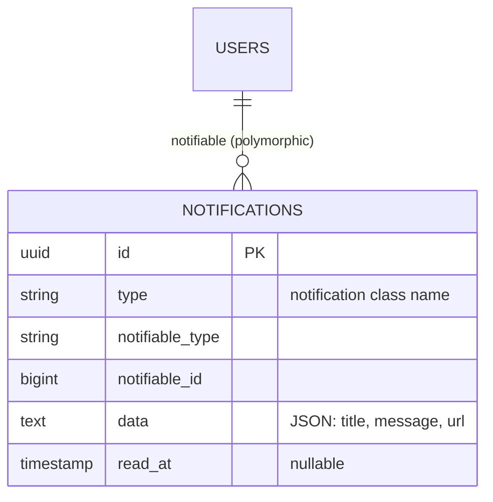
```mermaid
erDiagram
    USERS ||--o{ NOTIFICATIONS : "notifiable (polymorphic)"

    NOTIFICATIONS {
        uuid id PK
        string type "notification class name"
        string notifiable_type
        bigint notifiable_id
        text data "JSON: title, message, url"
        timestamp read_at "nullable"
    }
```

### Phase 6F scoping notes (see `ASSUMPTIONS.md` for the full reasoning)

- **Standard Laravel `notifications` table, unmodified.** Earlier planning notes described this
  as "extended," but every notification's contextual detail (title, message, target URL) fits
  inside the default `data` JSON column — no additional columns were ever needed.
- **No `notifications.user_id` foreign key** — `notifiable_type`/`notifiable_id` (Laravel's
  standard polymorphic pair) is used instead, exactly as the framework ships it, since the
  `Notifiable` trait and every helper (`$user->notifications()`, `unreadNotifications()`) already
  assume this shape.
- **Four `Notification` classes, one per named trigger** (`NewAnnouncementNotification`,
  `MeetingInvitationNotification`, `TaskAssignedNotification`,
  `InternalRequestStatusChangedNotification`), database channel only — no mail, matching the
  spec's explicit list of triggers with nothing added beyond it.

## Phase 7A: Research

```mermaid
erDiagram
    DEPARTMENTS ||--o{ RESEARCH_PROJECTS : owns
    USERS ||--o{ RESEARCH_PROJECTS : creates
    RESEARCH_PROJECTS ||--o{ RESEARCH_MEMBERS : has
    USERS ||--o{ RESEARCH_MEMBERS : "is a"
    RESEARCH_PROJECTS ||--o{ RESEARCH_OUTPUTS : produces

    RESEARCH_PROJECTS {
        bigint id PK
        bigint department_id FK "required — never college-wide"
        string title
        text description "nullable"
        string status "proposed|ongoing|completed|cancelled"
        date start_date "nullable"
        date end_date "nullable"
        string funding_source "nullable, free text"
        bigint created_by FK
        timestamp deleted_at "nullable, soft delete"
    }

    RESEARCH_MEMBERS {
        bigint id PK
        bigint research_project_id FK
        bigint user_id FK
        boolean is_lead "default false"
        bigint added_by FK
    }

    RESEARCH_OUTPUTS {
        bigint id PK
        bigint research_project_id FK
        string title
        string type "free text — journal article, patent, etc."
        text description "nullable"
        date output_date "nullable"
        string reference_url "nullable"
        bigint created_by FK
        timestamp deleted_at "nullable, soft delete"
    }
```

### Phase 7A scoping notes (see `ASSUMPTIONS.md` for the full reasoning)

- **`research_projects.department_id` is required, unlike the nullable college-wide/department
  pattern used by `announcements`/`events`/`meetings`/`documents` (Phase 6)** — a research
  project always belongs to exactly one department (the researcher's own), so there is no
  "entire college" broadcast case to model here.
- **New `research-extension.manage`/`research-extension.view` permission pair, shared by
  Research (this sub-phase) and Extension (Phase 7B)** — the spec gives both an identical
  permission row ("Submit research/extension records"), so one pair covers both rather than
  minting near-duplicate pairs per sub-phase.
- **Department Head is view-only (👁, own dept.) per the spec row — a deliberate departure from
  Phase 6's `operations.manage`, which was freely granted to Department Head.**
  `research-extension.manage` is Administrator-only in the seeder; Faculty's manage-own (🟡)
  capability is granted at the `ResearchProjectPolicy` layer via project leadership
  (`research_members.is_lead`), not a blanket `.manage` grant. See `ROLE_PERMISSIONS.md`.
- **`research_members.is_lead` is a boolean, not a `ResearchMemberRole` enum** — leadership is a
  genuinely binary state (you are or aren't the lead), the same reasoning already applied to
  `meeting_attendees.attended` (Phase 6B).
- **`research_outputs.type` and `research_projects.funding_source` are free strings, not
  enums** — output types (journal article, conference paper, patent, technical report, ...) and
  funding sources (internal, DOST-PCAARRD, CHED, ...) vary by institution and aren't a fixed,
  enumerable set, the same reasoning already applied to `internal_requests.type` and
  `faculty_trainings.training_type`.
- **No numeric budget/funding-amount column** — not explicitly required by the spec, and adding
  one would be scope creep; `funding_source` names where the money comes from, not how much.
- **A project's creator is automatically added as its first `research_members` row with
  `is_lead = true`**, in the same database transaction as project creation — this is what lets a
  brand-new Faculty project immediately satisfy `ResearchProjectPolicy::update()`'s
  lead-membership check without a separate "assign yourself" step.
- **`ResearchMember`/`ResearchOutput` have no dedicated ability logic of their own** —
  `ResearchMemberPolicy`/`ResearchOutputPolicy::create()`/`delete()` simply delegate to
  `ResearchProjectPolicy::update()` on the parent project, the same "child action authorized via
  the parent" pattern already established by `CompetencyEvaluator` (Phase 4B) and
  `MeetingAttendee`/`MeetingActionItem` (Phase 6B).

## Phase 7B: Extension

```mermaid
erDiagram
    DEPARTMENTS ||--o{ EXTENSION_PROJECTS : owns
    USERS ||--o{ EXTENSION_PROJECTS : creates
    EXTENSION_PROJECTS ||--o{ EXTENSION_MEMBERS : has
    USERS ||--o{ EXTENSION_MEMBERS : "is a"
    EXTENSION_PROJECTS ||--o{ EXTENSION_ACTIVITIES : conducts
    EXTENSION_PROJECTS ||--o{ EXTENSION_BENEFICIARIES : reaches

    EXTENSION_PROJECTS {
        bigint id PK
        bigint department_id FK "required — never college-wide"
        string title
        text description "nullable"
        string status "proposed|ongoing|completed|cancelled"
        date start_date "nullable"
        date end_date "nullable"
        string funding_source "nullable, free text"
        bigint created_by FK
        timestamp deleted_at "nullable, soft delete"
    }

    EXTENSION_MEMBERS {
        bigint id PK
        bigint extension_project_id FK
        bigint user_id FK
        boolean is_lead "default false"
        bigint added_by FK
    }

    EXTENSION_ACTIVITIES {
        bigint id PK
        bigint extension_project_id FK
        string title
        string activity_type "free text — training, outreach event, etc."
        text description "nullable"
        date activity_date "nullable"
        string location "nullable"
        bigint created_by FK
        timestamp deleted_at "nullable, soft delete"
    }

    EXTENSION_BENEFICIARIES {
        bigint id PK
        bigint extension_project_id FK
        string beneficiary_name
        string beneficiary_type "free text — individual, cooperative, LGU, etc."
        int count "nullable — people/households represented"
        string location "nullable"
        text notes "nullable"
        bigint created_by FK
        timestamp deleted_at "nullable, soft delete"
    }
```

### Phase 7B scoping notes (see `ASSUMPTIONS.md` for the full reasoning)

- **`ExtensionProject` is structurally identical to `ResearchProject` (Phase 7A) — same
  required `department_id`, same status lifecycle shape, same lead-member ownership model —
  built as a deliberate parallel, not a divergent design.** `ExtensionProjectPolicy`,
  `ExtensionProjectRequest`'s field-forcing, and the auto-lead-on-create transaction all mirror
  `ResearchProjectPolicy`/`ResearchProjectRequest`/`ResearchProjectController::store()` exactly.
- **New `ExtensionProjectStatus` enum, not a reuse of `ResearchProjectStatus`** — despite
  identical case values (proposed/ongoing/completed/cancelled). Following the same discipline
  that kept `ActionItemStatus` separate from `InterventionStatus` (Phase 6B): a status enum named
  for one project domain would be a misleading name reused for another, even where the states
  happen to line up.
- **Reuses `research-extension.manage`/`research-extension.view` (minted in Phase 7A)** — no new
  permission for this sub-phase, since the spec gives Research and Extension an identical
  permission row.
- **Extension has two child record types where Research has one** (`activities` and
  `beneficiaries` vs. just `outputs`), reflecting the spec's own description
  ("...activities conducted, and beneficiaries reached") rather than being padded out
  artificially. Both are still flat children of `extension_projects` — one level of nesting,
  matching every other parent/child pattern in this schema (no precedent anywhere for a second
  nesting level, e.g. beneficiaries tied to a specific activity rather than the project).
- **`extension_beneficiaries` is project-level, not activity-level** — a beneficiary entry
  (individual, cooperative, LGU, community, etc.) is attributed to the project as a whole, not to
  the specific activity that reached them. The spec doesn't require per-activity attribution, and
  modeling it would introduce the schema's first three-level parent chain for no stated benefit.
- **`extension_activities.activity_type` and `extension_beneficiaries.beneficiary_type` are free
  strings, not enums** — same "open-ended/institution-varying → free string" reasoning as
  `research_outputs.type` (Phase 7A) and `internal_requests.type` (Phase 6D): the set of activity
  and beneficiary kinds isn't fixed or enumerable.
- **`extension_beneficiaries.count` is a nullable integer, not a required field** — not every
  beneficiary entry necessarily has a countable headcount (e.g. an LGU partnership vs. "38
  farmer-households"), so it's optional rather than forced to a default of 0 or 1 that would
  misrepresent an unknown count as a real one.

## Phase 7C: Facilities

```mermaid
erDiagram
    DEPARTMENTS ||--o{ FACILITIES : "owns (nullable)"
    USERS ||--o{ FACILITIES : registers
    FACILITIES ||--o{ CLASS_SCHEDULES : hosts

    FACILITIES {
        bigint id PK
        string name "unique"
        string type "free text — laboratory, farm, greenhouse, field location, classroom, etc."
        bigint department_id FK "nullable — null means shared/college-wide"
        string location "nullable"
        int capacity "nullable"
        text description "nullable"
        boolean is_active "default true"
        bigint created_by FK "nullable — backfilled facilities have no human creator"
        timestamp deleted_at "nullable, soft delete"
    }
```

### Phase 7C scoping notes (see `ASSUMPTIONS.md` for the full reasoning)

- **No new permission** — `Facility` reuses `operations.manage`/`operations.view`, following the
  same free-design-judgment precedent Phase 6 established. The spec has no facilities-specific
  permission row (unlike Research/Extension's explicit 🅿7 row), so this is a design choice, not
  a literal spec requirement — a facility is an administrative/operational asset, closer in kind
  to a Document or Announcement than to a personally-owned Research project.
- **`facilities.department_id` is nullable, reusing the Announcement/Event/Meeting/Document
  shape** (`null` = shared/college-wide, set = department-owned) — unlike Research/Extension
  where every project is always department-owned. A facility genuinely can be either: a
  department-specific lab/farm, or a shared lecture hall anyone can be scheduled into.
- **`facilities.type` is a free string, not an enum**, despite the spec naming four examples
  (labs, farms, greenhouses, field locations) — real institutions have more location kinds than
  those four (this schema's own backfill needs "Classroom" to represent ordinary lecture rooms),
  so the set isn't genuinely fixed. Same "open-ended/institution-varying → free string" reasoning
  as `research_outputs.type` (Phase 7A) and `extension_activities.activity_type` (Phase 7B).
- **`facilities.created_by` is nullable** — the only nullable `created_by` in the schema.
  Facilities backfilled from historical `class_schedules.room` values are data-migration
  artifacts with no human creator to attribute; forcing a synthetic Administrator attribution
  would misrepresent history, so the column allows null instead.
- **`is_active` is a boolean, not a status enum** — active/inactive (e.g. a facility under
  renovation or decommissioned) is a genuinely binary state, the same "binary state → boolean"
  reasoning already applied to `meeting_attendees.attended` and `research_members.is_lead`.
- **The `class_schedules.room` → `facility_id` backfill (committed to in Phase 2) is fulfilled
  here.** A single migration adds the nullable `facility_id` FK, creates one `Facility` row
  (type `Classroom`, no department, no creator) per distinct historical `room` value, points
  every matching `class_schedules` row at it, then drops the now-redundant `room` column.
  `ClassScheduleRequest`, `ClassSchedule` model, `FacultyWorkloadService`, and the Class Sections
  Edit page's schedule form were all updated in the same sub-phase to reference `facility_id`
  instead of the free-text field.
- **No `Show` page** — `Facility` follows the same "simple lookup resource, Index says
  everything" reasoning as `Announcement`/`Event`/`DocumentCategory`, not the "genuine nested
  child data" reasoning that gave `Meeting`/`ResearchProject`/`ExtensionProject` their own Show
  pages. A facility has no child records of its own in this sub-phase.

## Phase 7D: Equipment

```mermaid
erDiagram
    DEPARTMENTS ||--o{ EQUIPMENT : "owns (nullable)"
    FACILITIES ||--o{ EQUIPMENT : "located at (nullable)"
    EQUIPMENT ||--o{ EQUIPMENT_BORROWINGS : has
    USERS ||--o{ EQUIPMENT_BORROWINGS : borrows
    EQUIPMENT_BORROWINGS ||--o| EQUIPMENT_RETURNS : "closed by"
    EQUIPMENT ||--o{ EQUIPMENT_MAINTENANCE : undergoes

    EQUIPMENT {
        bigint id PK
        string name
        string type "free text — microscope, tractor, laptop, etc."
        bigint department_id FK "nullable — null means shared/college-wide"
        bigint facility_id FK "nullable — current location"
        string serial_number "nullable, unique"
        string status "available|borrowed|under_maintenance|retired"
        text description "nullable"
        bigint created_by FK
        timestamp deleted_at "nullable, soft delete"
    }

    EQUIPMENT_BORROWINGS {
        bigint id PK
        bigint equipment_id FK
        bigint borrowed_by FK
        datetime borrowed_at
        date expected_return_at "nullable"
        text purpose "nullable"
        bigint recorded_by FK
    }

    EQUIPMENT_RETURNS {
        bigint id PK
        bigint equipment_borrowing_id FK "unique — one return per borrowing"
        datetime returned_at
        string condition_on_return "nullable"
        text notes "nullable"
        bigint recorded_by FK
    }

    EQUIPMENT_MAINTENANCE {
        bigint id PK
        bigint equipment_id FK
        text description
        date started_at
        date completed_at "nullable — null means ongoing"
        string performed_by "nullable, free text — not necessarily a system user"
        text notes "nullable"
        bigint recorded_by FK
    }
```

**No `accountabilities` table** — deliberately not built. See the scoping notes below.

### Phase 7D scoping notes (see `ASSUMPTIONS.md` for the full reasoning)

- **No new permission** — `Equipment` reuses `operations.manage`/`operations.view`, the same
  free-design-judgment precedent as `Facility` (Phase 7C): the spec has no equipment-specific
  permission row either.
- **`equipment.department_id` and `equipment.facility_id` are two independent, both-nullable
  fields, not one derived from the other.** `department_id` is organizational ownership (the
  `Facility`/Announcement/Event/Meeting shared-vs-department shape); `facility_id` is current
  physical location. A department's equipment doesn't stop being that department's just because
  it's temporarily housed in a shared facility, so the two must vary independently.
- **`equipment.status` is a persisted enum (`EquipmentStatus`: available/borrowed/
  under_maintenance/retired), not computed on demand** — unlike `FacultyWorkloadService`
  (Phase 5D) or progress computation (Phase 3A), which deliberately avoid a persisted status
  column for genuinely expensive aggregate calculations. Equipment status is a simple state
  machine driven directly by workflow actions (borrow/return/maintenance-start/
  maintenance-complete), the same shape as `Task`/`MeetingActionItem` status — a persisted column
  updated by its own controllers, not a derived aggregate.
- **`equipment_borrowings` and `equipment_returns` are two separate tables, not one table with a
  nullable `returned_at`** — this matches the spec's own literal table names
  (`DATABASE_DESIGN.md`'s planned-schema list names both explicitly), and reads more naturally as
  an audit trail: a borrowing record is written once at borrow time and never mutated; a return
  record is a separate event written once at return time. `equipment_returns.equipment_borrowing_id`
  is unique, enforcing at most one return per borrowing.
- **`equipment_maintenance` stays one table** (unlike borrowings/returns) with a nullable
  `completed_at` meaning "still ongoing" — the spec's planned-schema list names it as a single
  table, and a maintenance record naturally has one lifecycle (reported → in progress →
  completed) rather than two independent events.
- **No `delete()`/`destroy()` for borrowings, returns, or maintenance records** — once recorded,
  they're an immutable accountability trail, not resources to be edited or removed later. Only
  `Equipment` itself supports the usual full CRUD (including soft delete).
- **No persisted `accountabilities` table, despite being named in the original planned-schema
  list.** "Who is accountable for what equipment right now" is entirely derivable as
  `EquipmentBorrowing::whereDoesntHave('return')` — a live query, not a fact that needs its own
  storage. Persisting a parallel `accountabilities` table would create a second source of truth
  that has to be kept in sync with `equipment_borrowings`/`equipment_returns` on every
  borrow/return, for no benefit over querying directly. This is the same
  "computed-on-demand, persisted only where a workflow needs it" philosophy already applied to
  `FacultyWorkloadService` (Phase 5D — no `faculty_workloads` table) and progress computation
  (Phase 3A). The `Equipment/Accountability.tsx` report page and
  `EquipmentAccountabilityController` provide the same information live.
- **`equipment.serial_number` is nullable and unique** — not every item has (or needs) a serial
  number (e.g. simple tools), but when present it must be unambiguous.
- **`equipment_maintenance.performed_by` is a free string, not a `users` FK** — maintenance is
  frequently done by an external vendor or a non-system staff member, not necessarily anyone with
  a login. This is the same "the real-world actor isn't always a system user" reasoning that
  keeps `class_schedules.day_of_week` etc. plain rather than over-normalized.

**Phase 7 (Agriculture Support Modules) is now fully complete** across all four sub-phases
(7A–7D). See `PROJECT_PLAN.md` for the full phase roadmap.

## Phase 8A: Role-Based Dashboards

**No new tables.** Every dashboard number is computed live, on request, from tables every prior
phase already built — confirming the "no new domain tables expected" note for Phase 8 below.

### Phase 8A scoping notes (see `ASSUMPTIONS.md` for the full reasoning)

- **No persisted dashboard/analytics tables, no snapshotting.** `DashboardController` runs plain
  aggregate queries (`groupBy`, `withCount`-style counts) against `students`, `progress_alerts`,
  `graduation_candidates`, `internal_requests`, `meetings`, `research_projects`/
  `extension_projects`, and `equipment_borrowings` on every page load. This is the same
  "computed on demand, persisted only where a workflow needs it" philosophy already applied to
  `FacultyWorkloadService` (Phase 5D) and Equipment's deliberately-absent `accountabilities` table
  (Phase 7D).
- **Charts show current-state distributions, not time-series trends.** `ASSUMPTIONS.md`'s Phase 3
  note explicitly deferred a `student_progress_snapshots` table to "Phase 8 (Analytics) work,
  ...once something needs a point-in-time history to chart *over* time." This sub-phase's charts
  (students by status, graduation pipeline, at-risk by department, equipment by status) are all
  single-point-in-time groupings — none of them need history, so no snapshot table was
  introduced. A GWA-trend-over-time chart would still require one; that's explicitly out of scope
  here.
- **No new permission and no route-level permission gate.** `/dashboard` has always been open to
  any authenticated user (every role needs *some* dashboard) — Phase 8A's contribution is
  entirely in what `DashboardController` chooses to query and expose per role, not a new
  authorization rule. Department Head and Faculty scoping is enforced the same way it is
  everywhere else: direct `where('department_id', ...)` / `where('adviser_id', ...)` /
  `where('assigned_to', ...)` filters and the models' own `scopeVisibleTo()`, not a new mechanism.

## Phase 8B: Reports

**No new tables.** Same "compute on demand" discipline as Phase 8A — every report is a plain
query against existing tables (`student_enrollments`, `student_grades`, `progress_alerts`,
`graduation_candidates`, plus the Phase 5D faculty-workload aggregation), run fresh on every
request. There is no report-caching table: both the Inertia preview (`ReportController::show()`)
and the file exports (`ReportController::pdf()`/`excel()`) call the exact same
`ReportService::generate()` method, so what a user previews on screen and what they download can
never drift apart.

- **Report shape is either an aggregate summary or a detail listing, chosen per report.**
  Enrollment Summary and Academic Performance (Grade Distribution) are grouped aggregates
  (counts/percentages by program or grade); At-Risk & Progress Summary, Faculty Workload Summary,
  and Graduation Pipeline Summary are row-level listings (one row per alert/faculty
  member/candidate). This is a deliberate split from Phase 8A's Dashboard, which is
  aggregate-only — Reports exist to give exportable, actionable detail an admin would print or
  file, not just a KPI glance.
- **One generic exporter, one generic PDF template.** `App\Exports\ReportExport` (`FromArray`/
  `WithHeadings`) and `resources/views/pdf/report.blade.php` are both parameterized by
  `{headings, rows}` and reused across all 5 report types, avoiding five near-identical Export
  classes and five near-identical Blade files — the same generic-shared-implementation discipline
  used elsewhere in the project (e.g. shared enums, shared permission-scoping helpers).
- **`reports.view` is a single permission; college-vs-department scope is query-level, not a
  second permission tier.** Mirrors the pattern established in Phase 7A/7C/7D: one permission
  grants route access, and `ReportService::departmentIdFor()` forces a Department Head onto their
  own `department_id` while leaving Admin/Dean free to see everything or filter by department.
  See `ROLE_PERMISSIONS.md`'s Phase 8B section and `ASSUMPTIONS.md` for the full reasoning.

## Phase 8C: Backup and Restore

**No new tables.** Backups are plain `.sql` files under `storage/app/private/backups/` — the
filesystem is the source of truth for what backups exist; `BackupService::list()` reads the
directory directly rather than tracking rows in a database table (the same "compute on demand"
discipline as every other Phase 8 sub-phase). Who triggered a backup or restore, and when, is
recorded via the existing `spatie/laravel-activitylog` infrastructure under `log_name = "backups"`
— visible in the Phase 1 Audit Logs viewer — rather than a dedicated `backups` table.

- **`mysqldump`/`mysql` are shelled out to via Laravel's `Process` facade**, not a package —
  `barryvdh/laravel-dompdf` and `maatwebsite/excel` cover PDF/Excel (Phase 8B); backup/restore has
  no comparable package need since it's a single database engine (MySQL/MariaDB), not a
  multi-format export.
- **A real, environment-specific bug was found and fixed during live verification**: Symfony
  Process's default environment derivation only fully inherits the parent process's environment on
  the `cli`/`phpdbg`/`embed` PHP SAPIs. `php artisan serve` runs under `cli-server`, which instead
  intersects `getenv()` with `$_SERVER` — and on this Windows host that silently dropped a variable
  `mysqldump.exe`'s own Winsock initialization depends on, failing with `Can't create TCP/IP socket
  (10106)`. `BackupService::mysqlEnv()` now explicitly passes the full `getenv()` to every
  `Process` call, sidestepping the SAPI-dependent filtering entirely. See `ASSUMPTIONS.md` for the
  full diagnostic trail.
- **Filenames are a single closed pattern** (`ca-apoms_YYYY-MM-DD_HHmmss.sql`), enforced both in
  the route (`Route::where()`) and again inside `BackupService` itself — a filename is never taken
  as free-form user input anywhere in the download/restore path, closing off path traversal by
  construction rather than by sanitization.

## Phase 8D: Hardening and Finalization

**No new tables and no schema changes.** Phase 8D is an audit-and-fix pass across the existing
schema/codebase (N+1 queries, authorization coverage, mass-assignment guards) plus an
accessibility pass and the closing documentation set — see `ASSUMPTIONS.md` and
`PROJECT_PLAN.md`'s Phase 8D section for the full findings. This is the last sub-phase of the
project; the schema inventory below reflects its final, complete state.

## Planned Schema by Domain (all phases)

Tables below are grouped by the module that introduces them, per `PROJECT_PLAN.md`'s phase
list. This is the authoritative table inventory referenced by every phase; each phase's own
migrations are the source of truth for exact columns at build time — this list will not be
retrofitted with implementation details until a table actually exists, to avoid the doc
drifting from the code.

**Phase 1 — Foundation** (built): `colleges`, `departments`, `programs`, `academic_years`,
`semesters`, `users` (extended), `roles`, `permissions`, `model_has_roles`,
`role_has_permissions`, `login_logs`, `activity_logs`.

**Phase 2 — Core Academic Management** (built): `year_levels`, `sections`, `students`,
`student_guardians`, `student_addresses`, `student_documents`, `student_status_histories`,
`curricula`, `courses`, `curriculum_courses`, `course_prerequisites`, `course_corequisites`,
`student_enrollments`, `enrollment_courses`, `class_sections`, `class_schedules`,
`faculty_assignments`, `grading_scales`, `grading_scale_values`, `student_grades`,
`grade_submissions`, `grade_change_logs`, `import_batches`, `import_batch_errors`. No
standalone `majors` or `facilities` table — see the Phase 2 scoping notes above.

**Phase 3 — Student Progress** (built): `student_advisers`, `student_advising_records`,
`student_intervention_followups`, `academic_deficiencies`, `progress_alerts`. No
`student_progress_snapshots` table — checklist status, GWA, and completion percentage are
computed on demand by `ProgressComputationService` on every page load rather than snapshotted,
per the Phase 3A scoping notes above; a historical-trend view of these values over time is
Phase 8 (Analytics) territory, not Phase 3's.

**Phase 4 — Graduating Student Evaluation** (built): `graduation_candidates`,
`graduation_requirement_templates`, `student_graduation_requirements` (Phase 4A),
`competency_categories`, `competency_indicators`, `competency_evaluators`, `competency_ratings`
(Phase 4B). No `graduation_evaluations`, `graduation_recommendations`, or
`graduation_approvals` tables — `GraduationCandidate.status` plus six recommendation/decision
columns and one `graduated_at` column added directly to `graduation_candidates` carry the
umbrella state and audit fields through every sub-phase (Phase 4C/4D — see above); see the
Phase 4A, 4C, and 4D scoping notes. PDF generation (`barryvdh/laravel-dompdf`) introduced in
Phase 4D — no new tables, plain Blade views under `resources/views/pdf/`.

**Phase 5 — Faculty Management (complete)**: `faculty_profiles`, `faculty_education`,
`faculty_credentials`, `faculty_trainings`, `faculty_awards`, `faculty_documents` (built, Phase
5A/5B/5C — see above). No dedicated workload table — Phase 5D computes teaching load on demand
from Phase 2E's `faculty_assignments` (see the Phase 5D scoping notes above). "Assign faculty to
courses/sections" is likewise already covered by `faculty_assignments`; no separate Phase 5
assignment table was ever needed.

**Phase 6 — College Operations (complete)**: `announcements`, `events` (Phase 6A), `meetings`,
`meeting_attendees`, `meeting_action_items` (Phase 6B), `tasks` (Phase 6C), `internal_requests`,
`request_histories` (Phase 6D), `document_categories`, `documents`, `document_versions`
(Phase 6E), `notifications` (Phase 6F — see above; the standard Laravel table, no extension
needed after all).

**Phase 7 — Agriculture Support Modules** (✅ fully built): `research_projects`,
`research_members`, `research_outputs` (Phase 7A), `extension_projects`, `extension_members`,
`extension_activities`, `extension_beneficiaries` (Phase 7B), `facilities` (Phase 7C),
`equipment`, `equipment_borrowings`, `equipment_returns`, `equipment_maintenance` (Phase 7D).
No `accountabilities` table — computed on demand from `equipment_borrowings`/
`equipment_returns`; see the Phase 7D scoping notes above.

**Phase 8 — Analytics and Finalization**: no new domain tables expected; this phase reads
from everything above. Any report-caching tables discovered to be necessary during that phase
will be documented here at that time.

## Foreign Key and Delete Behavior

- `restrictOnDelete()` is the default for any FK into a table that is itself
  soft-deletable and institutionally significant (departments, programs, students, faculty,
  curricula, courses) — the business rule "deleting referenced academic records should be
  prevented" is enforced at the database level, not just the application level.
- Pivot/detail rows that only make sense attached to their parent (e.g.
  `enrollment_courses` under `student_enrollments`, `competency_ratings` under
  `graduation_evaluations`) use `cascadeOnDelete()`.
- `department_head_id` on `departments` is nullable and does **not** cascade-delete the
  department if the user record is removed — it is set null instead, since a department
  outlives any individual head assignment.
